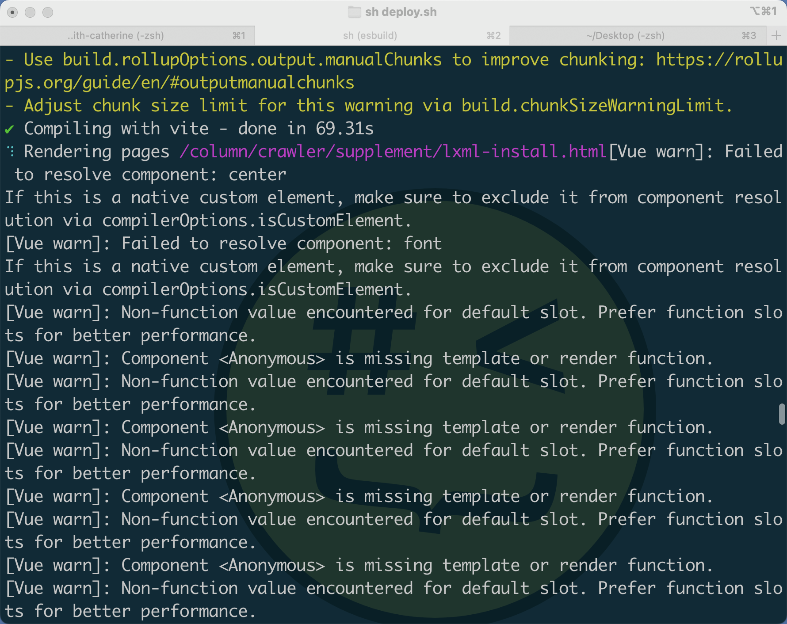

# SearchEngine Document

## What?

带编程一对一学员学习 Python 所开发的库，初衷是为了给私教学员拥有独自独立开发的 Python 库，而产生的全局搜索库。虽然，现在很多 IDE 已经实现全局搜索的功能，但是个人还是比较喜欢自己重复造轮子一下。

如果，你无法理解什么是全局搜索，我这里举两个 IDE 的例子。

- PyCharm：[]
- VsCode：[]

**是什么驱使我准备深度开发此库呢？**

我的网站在构建的时，出现如下警告⚠️：

我就发现，此问题是我使用了遗弃的 HTML 标签🏷️导致的，但是我的文章较多，，七百多篇中要去检索到此内容并修改。如果一个一个的修改，显然工作量巨大。此时，就想起了带 William 开发的 Note Search 库。

接下来，今天正式开始动工！2023-02-21 23:50:19

## ChangeLog

### FindEngine 0.0.1 2023-02-22 00:36:58

- FindEngine 0.0.1：[https://pypi.org/project/FindEngine/0.0.1/](https://pypi.org/project/FindEngine/0.0.1/)

- 代码环境搭建：

## License

这是一款自由和无拘束的软件，已发布到公共领域。

> This is free and unencumbered software released into the public domain.

任何人都可以自由使用和分享该软件，包括源代码和编译后的二进制形式，用于商业或非商业目的都可以，但必须署名该[仓库][仓库]和[博客][blog]链接。

> Anyone is free to use and share this software, in both source code and compiled binary forms, for both commercial and non-commercial purposes, as long as the repository and blog links are attributed.

[仓库]:https://github.com/AndersonHJB/SearchEngine
[blog]:https://bornforthis.cn

