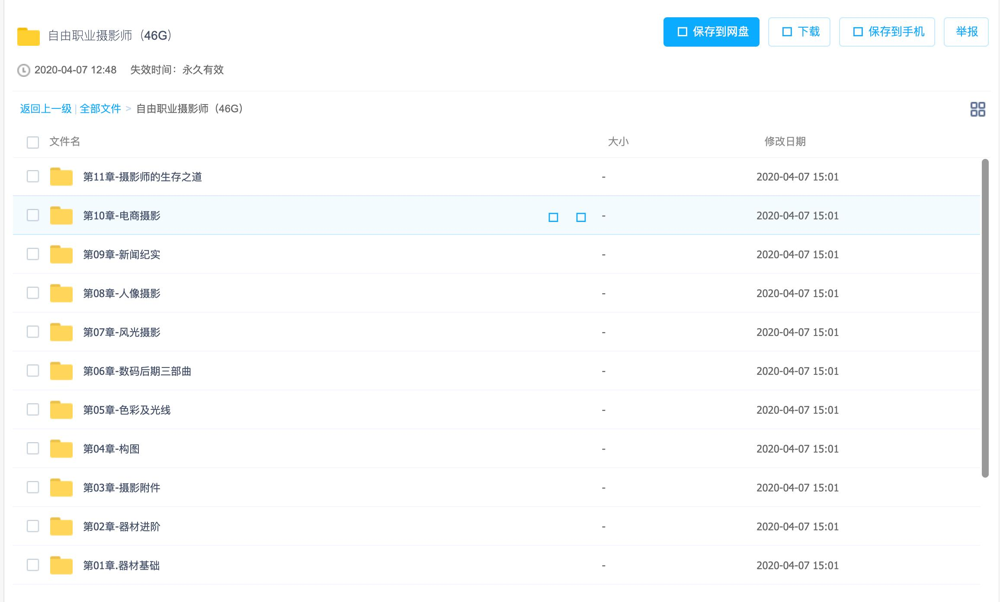

## 全套视频百度网盘下载地址：

价格：50元，付款后。

::: details 微信

:::

::: details 支付宝

:::

添加微信：Jiabcdefh

### 学摄影时，我们都在学什么？

> 咔图摄影教育中心 叶梓

不少摄影人纠结于繁复的相机操作，同时还要考虑构图、色彩、光线的事情，一个脑子实在是不够用！学的越多，就越是不知道该怎么拍才好！摄影真的有那么复杂吗？恐怕不是！

本课程由国际摄影爱好者协会（IPEA）主席，咔图摄影教育中心创始人及CEO叶梓老师全程亲授， 你将掌握自由职业摄影师所需全部技能，并学会如何从零到一创建自己的工作室。

> 讲师介绍：
> 知名摄影师、摄影讲师、行业意见领袖亲制亲授
> 叶梓
> 咔图摄影教育中心创始人及CEO
> 叶梓咔图摄影教育中心创始人及CEO自由摄影师，Adobe资深客席讲师，Datacolor色彩管理专家，曾为《中国摄影报》撰写专栏。曾于北京水立方等场馆举办三次个展，作品曾于德国十城巡展，进修于玛格南大师班，师从英国摄影师Olivia Arthur。叶梓先生从事摄影教育多年，其希望以摄影艺术、审美教育为手段，最终达到改善人们生活品质的目标。

## 包含课程

### 1 器材基础必修

**适合人群：没有摄影基础，或者基础薄弱没有接受过系统教学的摄影人。**

1. 为什么我要学这门课？
2. 器材操作是摄影艺术的基础，如果器材操作不熟悉，就有如当兵的不会用枪；
3. 如今网络上的摄影教程五花八门，其中存在不少误区，真假难辩；
4. 摄影的坏习惯一旦形成，就很难纠正，因此你需要一位引路人；
5. 兴趣很重要，不要被那些枯燥的说教磨灭了你的热情；
6. 顶级的讲师为你授课，费用还不及他平时授课费的1/20，你还犹豫什么？

### 2 器材进阶必修

**适合人群：希望深入学习器材操作的高级技巧，或者基础薄弱没有接受过系统教学的摄影人。**

1. 学完这门课我可以：
2. 全面了解手中器材的优缺点，扬长避短；
3. 摆脱器材的束缚，任何设备都能拍出背景虚化的照片；
4. 拍出神奇的多重曝摄影作品；
5. 了解各类镜头的特点及优缺点；
6. 哦！原来以前看到的那张大师照是这么拍的！

### 3 摄影附件必修

**适合人群：职业摄影师必备技能及风光、人像摄影爱好者。**

1. 为什么我要学这门课？
2. 有些滤镜的效果是后期所无法达到的；
3. 绝大多数的风光摄影及商业摄影均需用到摄影附件；
4. 只买对的，不买贵的，教你挑选适合自己的附件；
5. 了解各类相机的优缺点，丰富自己的专业摄影知识；
6. 顶级的讲师为你授课，费用还不及他平时授课费的零头，你还犹豫什么？

### 4 构图必修

**适合人群：想要拍出漂亮照片的你。**

1. 为什么我要学这门课？
2. 了解摄影人在创作时的思维步骤；
3. 迅速拍出漂亮的照片；
4. 学会不同的构图方法，作品从此不再单一；
5. 让我们的照片离完美又近了一步；
6. 顶级的讲师为你授课，费用还不及他平时授课费的零头，你还犹豫什么？

### 5 色彩及光线必修

**适合人群：想要拍出漂亮照片的你。**

1. 为什么我要学这门课？
2. 了解色彩带给我们的心理影响，如何搭配色彩；
3. 认知白平衡及色温的意义；
4. 不同光的拍摄手法；
5. 掌握摄影的基本常识；
6. 顶级的讲师为你授课，费用还不及他平时授课费的零头，你还犹豫什么？

### 6 数码后期三部曲必修

**适合人群：想要成立自己的摄影工作室进行商业拍摄的摄影师，或者希望进一步完善自己摄影作品的摄影爱好者。**

1. 为什么我要学这门课？
2. 节省照片整理的时间，科学管理照片；
3. 快速修饰和挑选照片；
4. 校正屏幕、相机及打印机的色彩，与色差说拜拜；
5. 版权很重要，学会如何维权；
6. 顶级的讲师为你授课，费用还不及他平时授课费的零头，你还犹豫什么？

### 7 风光摄影必修

**适合人群：想要成为职业风光摄影师或风光摄影爱好者。**

1. 为什么我要学这门课？
2. 了解风光摄影的器材准备；
3. 掌握不同天气的拍摄手法；
4. 把握最佳的拍摄光线；
5. 全面提升自己风光摄影的技能；
6. 顶级的讲师为你授课，费用还不及他平时授课费的零头，你还犹豫什么？

### 8 人像摄影必修

**适合人群：自由职业摄影师或摄影爱好者。**

1. 为什么我要学这门课？
2. 电商拍模特离不开人像摄影；
3. 组建婚纱、婚礼摄影工作室离不开人像摄影；
4. 接拍儿童摄影的工作离不开人像摄影；
5. 生活记录更离不开人像摄影；
6. 顶级的讲师为你授课，费用还不及他平时授课费的零头，你还犹豫什么？

### 9 新闻纪实必修

1. 适合人群：喜爱新闻纪实类摄影人群。
2. 为什么我要学这门课？
3. 让我们知道新闻纪实的摄影意义；
4. 了解新闻纪实的特性；
5. 用它去简述你身边感人的故事；
6. 欣赏大师级的新闻纪实摄影作品；
7. 顶级的讲师为你授课，费用还不及他平时授课费的零头，你还犹豫什么？

### 10 电商摄影必修

1. 适合人群：电商创业者。
2. 为什么我要学这门课？
3. 怎么拍照片促进我们的销售量；
4. 各类商品的拍摄方法；
5. 如何布置商品的拍摄环境；
6. 必不可少的后期处理；
7. 顶级的讲师为你授课，费用还不及他平时授课费的零头，你还犹豫什么？

### 11 摄影师的生存之道必修

适合人群：针对希望从事摄影行业及业余摄影爱好者。

1. 为什么我要学这门课？
2. 了解自己照片的权利；
3. 如何为自己进行营销；
4. 做好自己的经纪人；
5. 维护自己的权益；
6. 顶级的讲师为你授课，费用还不及他平时授课费的零头，你还犹豫什么？

课程资源截图：

