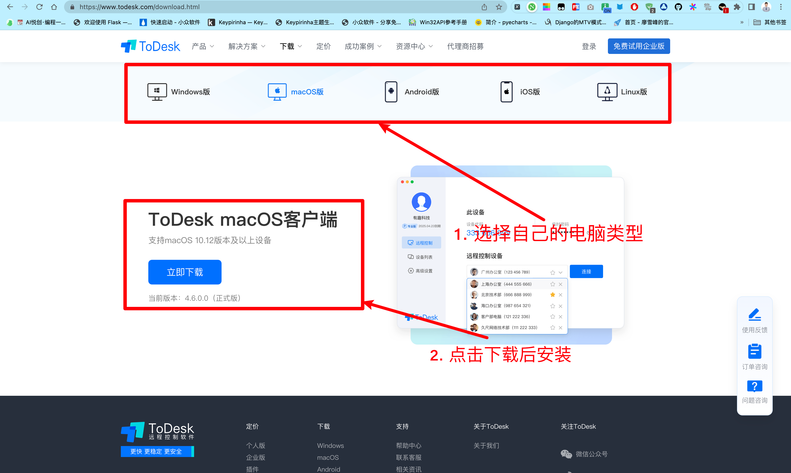
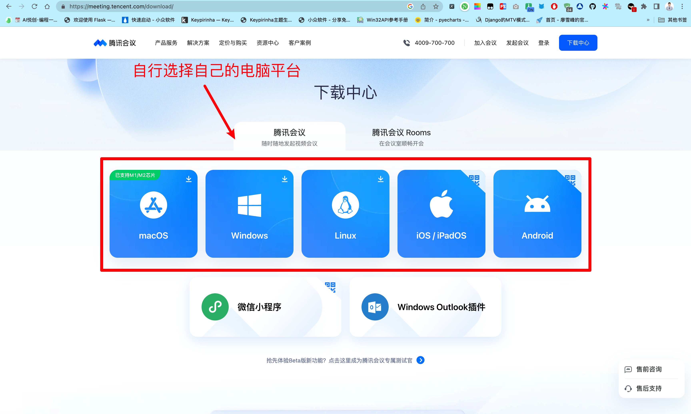

::: tip 寄语

欢迎👏你加入 AI悦创编程私教这个大家庭，也请相信你的选择是对的。我不能说我有多优秀的履历，但是我可以负责任的说：我是私教学员的良师益友。一步一步脚踏实地的来接触编程这个世界吧～

:::

## 看看自己有什么设备吧🎉

| 序号       | 设备1       | 设备2      | 设备3      | 星级   | 阅读链接          |
| ---------- | ----------- | ---------- | ---------- | ------ | ----------------- |
| **方案一** | Mac/Windows | iPad       | 外界显示器 | 🌟🌟🌟🌟🌟🌟 | [方案一](#方案一) |
| **方案二** | Mac/Windows | iPad       |            | 🌟🌟🌟🌟🌟  |                   |
| **方案三** | Mac/Windows | 外界显示器 |            | 🌟🌟🌟🌟🌟  |                   |
| **方案四** | Mac/Windows | 手机       |            | 🌟      |                   |
| **方案五** | Mac/Windows |            |            | 🌟      |                   |

::: info 注意

上面的方案不是指，低星就不能上课，星级代表上课的便捷性。

有两个屏幕的方便上课，原因是：

- 学生看我屏幕
- 我要看学生屏幕

如果只有一个屏幕，那么需要频繁切换软件，举个例子🌰：一个软件是看我屏幕，一个软件是写代码「甚至不止一个软件。还有可能需要设置环境、启动其他软件等」。那么，在你切换软件操作时，一个屏幕不能同时看我屏幕同步操作。

而两个屏幕可以互不影响，可以同步跟我操作。这个时候，你第二个屏幕是手机的话，屏幕太小也不方便，所以不推荐。

:::

## 方案✈️

### 方案一

**首选方案：**

- **zoom**：[https://zoom.us/download](https://zoom.us/download)
- **ToDesk** 远程控制：[https://www.todesk.com/download.html](https://www.todesk.com/download.html)
- **安装平台：**
    - Mac/Windows、iPad 安装 zoom
    - Mac/Windows：安装 ToDesk

**备用方案：**

- **腾讯会议**：[https://meeting.tencent.com/download/](https://meeting.tencent.com/download/)
- **飞书**：[https://www.feishu.cn/download](https://www.feishu.cn/download)
- **ToDesk** 远程控制：[https://www.todesk.com/download.html](https://www.todesk.com/download.html)
- **安装平台：**
    - Mac/Windows、iPad 安装 飞书、腾讯会议
    - Mac/Windows：

::: tabs

@tab zoom 图示

@tab ToDesk 图示

@tab 腾讯会议

@tab 飞书

:::

