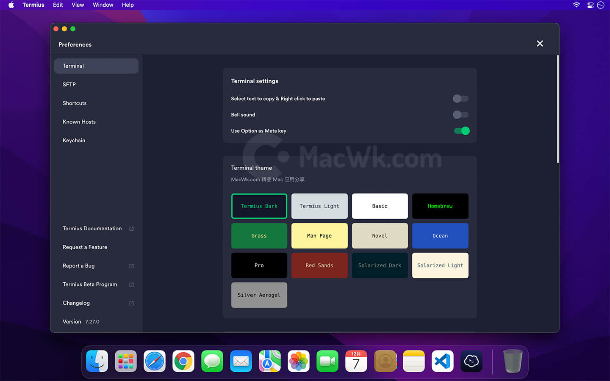

## 特别提醒

防止影响某些功能的可用性，我没有去掉试用窗口，在第一次安装运行后会弹出一个试用登录窗口，只需要点击 `Continue Without Account` 即可。（该窗口只出现一次）

 Termius Mac 破解版是一款非常好用而且漂亮的 SSH 客户端，能快速远程控制服务器，可以定制自己喜欢的主题，支持 FTP/SFTP 连接。

### 快速方便的连接

通过清晰的分组列表帮助您方便快速的通过 SSH 连接您的服务器。

### 稳定高效的 command

无需每次都输入连接密码，只需双击服务器名称即刻连接

### 主题定制

统一漂亮舒适的 commond，支持12种主题切换，可以调整字体大小

**软件下载地址：**[**https://xiaoniaoyun.im/f/R5SQS6**](https://xiaoniaoyun.im/f/R5SQS6)

失效请留言。

::: details 公众号：AI悦创【二维码】

:::

::: info AI悦创·编程一对一

AI悦创·推出辅导班啦，包括「Python 语言辅导班、C++ 辅导班、java 辅导班、算法/数据结构辅导班、少儿编程、pygame 游戏开发」，全部都是一对一教学：一对一辅导 + 一对一答疑 + 布置作业 + 项目实践等。当然，还有线下线上摄影课程、Photoshop、Premiere 一对一教学、QQ、微信在线，随时响应！微信：Jiabcdefh

C++ 信息奥赛题解，长期更新！长期招收一对一中小学信息奥赛集训，莆田、厦门地区有机会线下上门，其他地区线上。微信：Jiabcdefh

方法一：[QQ](http://wpa.qq.com/msgrd?v=3&uin=1432803776&site=qq&menu=yes)

方法二：微信：Jiabcdefh

:::

