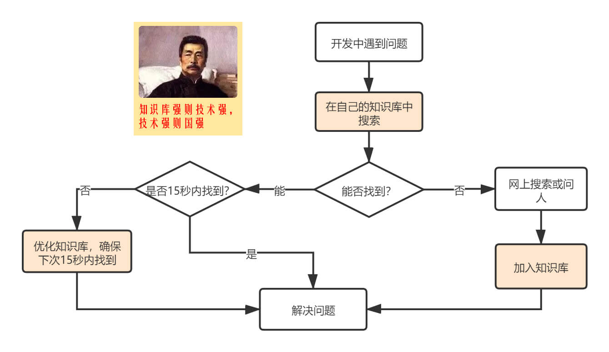

::: tip 手札

除了需要一个现实的此时之外，还需要一个诗意的世界。——AI悦创

:::

:::: details 手札

::: tip 手札2

不管别人说什么，说得有得对，有的错，没有界于对错之间的话。——AI悦创

> And whatever people say, there is right, there is wrong. There is nothing in between.
>
> 无论人们说什么，都有对的，也有错的。没有介于两者之间的东西。

:::

::: tip 手札3 2022年1月2日 朋友聊天

社会这个火锅，涮过了，才知道谁是毛肚，谁是生菜。——AI悦创

:::

::: tip 手札 2023年01月08月 AI悦创 and TommyTian

有时候我们不仅仅要看选择项以内的答案，有时候也要想想选择项以外的答案。——AI悦创

:::

::::

## 一图胜千言

::: tip 手札1

笔记是对博客、以及阅读过的书中内容的整理和归纳。

:::

## 概述

在计算机领域，每个人都需要花相当多的时间来学习该领域的基础知识，而且在学习的过程中经常会遇到之前学过的内容，一段时间后就会忘记，再次拾起来的过程是比较消耗时间的，为了避免这种情况出现，在这里把各个领域的知识记录下来，归纳成一个完整的知识网络。

## 对博客的理解

喜欢写 Blog 的人，会经历三个阶段。

> 第一阶段，刚接触 Blog，觉得很新鲜，试着选择一个免费空间来写。

> 第二阶段，发现免费空间限制太多，就自己购买域名和空间，搭建独立博客。

> 第三阶段，觉得独立博客的管理太麻烦，最好在保留控制权的前提下，让别人来管，自己只负责写文章。

我们每个人的在网络上产生的数据越来越多，这些信息是我们在互联网上存在过的痕迹，值得我们认真对待。但是它们被分散分布在各个网站上。很多时候我们很难将它们聚合在一起，而且各个网站的信息排布方式也没有办法自由控制，所以我们需要一个可以由自己主宰的空间——博客。

通过博客，我们可以记录自己的生活和成长的轨迹。它不像 Twitter 那样碎片化，也不像 Facebook 那样关系化，它是私人的空间。

## 悦创·语录

::: tip 2022年12月9号 车上

不是因为能赚钱才去学什么，而是因为学了，当赚钱的机会摆在你面前的时候，你才有能力把握住。

> 当你看看见的时候，其实已经晚了。

:::

::: tip 愿景 2023年1月4日

我们的愿景是培养面向未来的公民。我们相信个体的使命，我们相信个人的潜能，我们相信学习的力量，我们更无比坚定地相信：教育的本质是赋予每一个人追求“诗和远方”的自由。

我们的使命是让高性价比、高效卓越的高等教育人人皆可享有。我们相信每一个人都有享受优质教育的权利，我们相信“做是最好的学”，教育应该鼓励动手实践，解决问题，团队协作，而不是一味地灌输知识；我们相信在瞬息万变的今天，学习不再是一次短暂的生命旅程，而是一项伴随终生的使命。

:::

## 创作者应该为谁创作？寻找创作自由

::: tip

「How to Find Creative Freedom」

:::

## 为自己创作

::: tip

哲学家 Alan Watts 认为自己是“从山边冒出的泉水” — 如果路人喝了泉水并且很享受，这很好，但这不是泉水的目的。

泉水只是存在。(The spring just exists.)

:::

Ali Abdaal [引用这个例子来说明他对创作的态度](https://aliabdaal.com/how-to-find-creative-freedom/)：是为了自己写作和拍视频，如果这帮助到了一个人，是一个很棒的附加奖励，但这并不是写作和拍视频的目的。

只有为自己创作后，才能创作自己想创作的东西，想什么时候创作就什么时候创作，这称为创作自由。

其中有趣的地方是，Ali 在鼓励新手创作者，说明他们可以创造什么内容时说到：要创造至少对世界上的一个人有帮助的东西。

这个矛盾的地方是不是可以这么理解：以「创造对别人有用的的东西」为目的只是为一开始的探索期提供灵感，提供内容；当你在探索过程中逐渐得心应手，明白自己想创作什么时，就不必局限在必须为别人创作点什么的想法里，开始以「为自己创作」为目的，才能拥有创作自由，成为那个只是存在着的泉水。

- 刚开始创作时：创造至少对世界的上一个人有帮助的东西。
- 创作得心应手后：为自己创作，对别人有帮助是副加的奖励。

---

David Perell 的观点是要为自己写作，或者为一个你想吸引的那类读者的一个代表人物写作。

David Perell 强调不要为一群人写作，因为那会让你感到不知所措，只为一个人写作，不管是为你自己，还是为一个想吸引的读者的代表人。

- 为自己写作时：思考什么是6个月前的自己想要知道的事，专注于那个会让自己感到惊喜的想法。
- 为他人写作时：可以在文章的开头写下你想吸引的那类读者的特点，比如：凯文阅读信息的速度非常快，他是一个科技公司的创始人，他对严谨思考的渴望和对空洞想法的不耐烦一样，所以赶紧说重点。

这对我的启发是，写文章的初心是为自己写，当意识到正在写的东西可能会对一个人有帮助时，要想着这个人去写，就像在酒吧和朋友对话一样，尊重对方，用自然流畅的语言表达你的观点。

## 不要只是为自己创作

「不要只是为自己创作」是从另一个角度切入的，从是私人写作还是公开写作出发。

当你在私下写作，这没有为自己写作还是为他人写作之分，私下写作是为自己写作，可能是对过去的自己反思，也可能是对未来的自己喊话。

David Perell 认为不要只是为自己写作，要把你的文章发布在网上。公开写作就像是请朋友到家里做客一样，你会打扫干净你的房间，仔细检查要准备的所有东西。就像你为客人做饭一样，当别人在看着你，你的名誉可能受到威胁时，你会更加努力，社交压力会迫使你提高自己的水平。

## 总结

1. 公开写作，不要私下写作。
2. 没有创作灵感时，写对他人有帮助的内容，心里想着那一个你想吸引的读者，为他/她创作。
3. 有创作灵感时，为自己创作（也可以为一个人创作），写自己感兴趣的内容，找到创作自由。

## 关联阅读

- [How to Find Creative Freedom](https://aliabdaal.com/how-to-find-creative-freedom/)
- [Write for One Person](https://perell.com/note/write-for-yourself/)
- [独立博客过时以后，为什么开始写博客了？](https://cuttontail.blog/blog/life/why-blog/)

