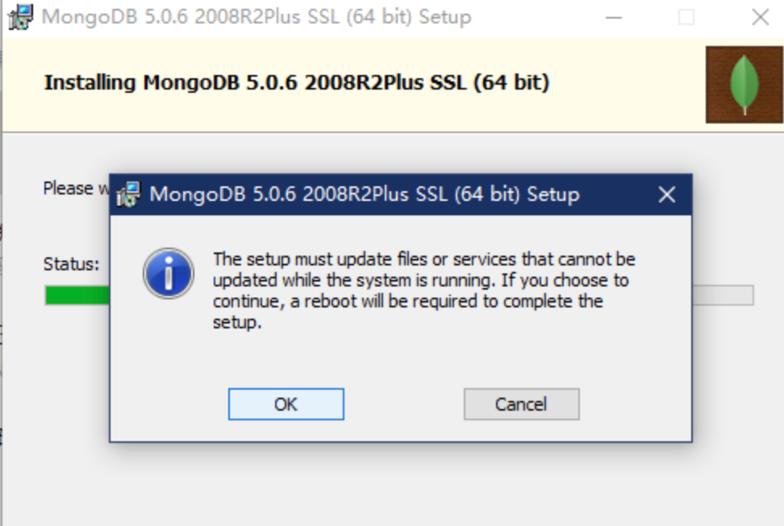
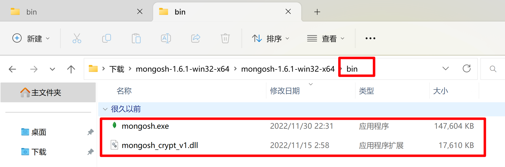
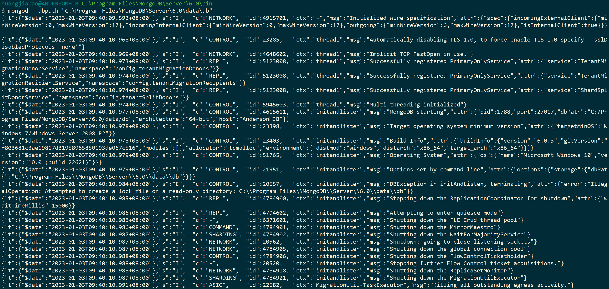
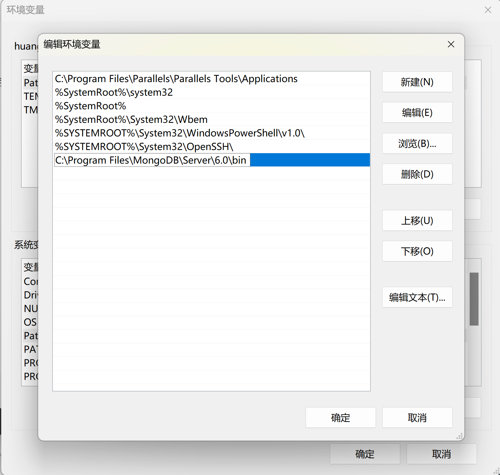

你好，我是悦创。

::: tip 吐槽

这篇博客的产生是因为本人被 MongoDB 的安装坑了几次，为避免各位朋友在同一个地方踩坑，下面我会详细的讲解说明我的安装步骤。本人的电脑是 Window10 系统，如果系统和我相同保证你安装成功。

:::

::: tip 说明

我用的是 brew 进行安装，且输入：

```shell
mongosh
```

正常响应。如果你使用其他方法，且成功了，记得留言，这样可以为后来者铺路。有问题也可以留言讨论！

:::

MongoDB 现在已经出到了 6.x 版本，很多的安装教程是基于 4.x、3.x 版本，可能已经过期。

接下来，我将分享最新的安装教程。

MongoDB 是由 C++ 语言编写的非关系型数据库，是一个基于分布式文件存储的开源数据库系统，其内容存储形式类似 JSON 对象，它的字段值可以包含其他文档、数组及文档数组，非常灵活。

MongoDB 支持多种平台，包括 Windows、Linux、Mac OS、Solaris 等，在其官方网站（[https://www.mongodb.com/try/download/community](https://www.mongodb.com/try/download/community)）均可找到对应的安装包。

MongoDB 安装包含两部分：一个是 MongoDB 安装。一个是可视化软件安装（Studio 3T）。如果你使用命令行操作 MongoDB，可以不安装 Studio 3T，但是本人建议你安装 Studio 3T，因为不需要在命令行输入繁琐的命令，直接在 Studio 3T 上操作即可，用起来很方便。


本节中，我们来看下它的安装过程。

## 1. 相关链接

- 官方网站：[https://www.mongodb.com](https://www.mongodb.com/)
- 官方文档：[https://www.mongodb.com/docs/](https://www.mongodb.com/docs/)
- GitHub：https://github.com/mongodb
- 中文教程：[https://www.runoob.com/mongodb/mongodb-tutorial.html](https://www.runoob.com/mongodb/mongodb-tutorial.html)

## 2. Windows 下的安装

这里直接在官网（如图 1 所示）点击 DOWNLOAD 按钮下载 msi 安装包即可。


下载 `.msi` 文件，下载后双击该文件，按操作提示安装即可。

下载完成后，双击它开始安装，指定 MongoDB 的安装路径，例如此处我指定的安装路径为 `C:\Program Files\MongoDB\Server\6.0\`。当然，这里也可以自行选择路径。

::: details 长图


默认安装是在 C 盘，点击 **Browse…** 选择你要安装的盘，选择好安装的盘后在点击 Next。**注意：记住你安装在某盘的路径，后面配置环境变量要用到。**


默认是勾选上的，选择不勾选(Install MongoDB Compass)，点击 Next。


弹出**图一**点击OK，继续操作。如果弹出**图二**请看：**3、安装MongoDB提示权限不足的解决方法**。

**图一：**



**图二：**


你也可以选择重启电脑一下，以免部分电脑无法 update 环境变量。

:::

### 2.1 MongoDB 配置

1. 重启电脑后，找到并打开你安装 MongoDB 的位置，一直打开到 bin 文件夹。在键盘上按 `Window + R`  打开运行窗口，输入 cmd，弹出命令提示符窗口，在命令提示符窗口输入 mongo。如下图：


2. 电脑桌面找到此电脑图标，右击此电脑图标，点击属性，找到高级系统设置并点击（打开后如下图）。


**注意：下图的步骤是你自己的安装路径（就是前面记住的路径，再加上\bin）输入后依次点击确定**。


3. 进入 MongoDB 官网下载[MongoDB Shell](https://www.mongodb.com/try/download/shell)：https://www.mongodb.com/try/download/shell


4. 找到下载的文件解压，解压后找到 bin 文件打开，bin 文件下有 2 个文件， **mongosh** 文件和 **mongosh_crypt_v1** 文件，复制这 2 个文件到刚刚安装 MongoDB 路径下的 bin 文件里面。




找到 bin 拷贝到我们的安装路径/bin 下：


5. 复制后，在键盘上按 `Window + R` 打开运行窗口，输入 cmd，弹出命令提示符窗口，在命令提示符窗口输入 **mongod**，弹出以下内容后继续输入 **mongosh** ，弹出以下内容后继续输入 **show dbs**。如下图：


```mongodb
test> show dbs
admin   40.00 KiB
config  60.00 KiB
local   72.00 KiB
test>
```

**至此，MongoDB 安装完成**。

### 2.2 Studio 3T 可视化软件安装

1. 进入 Studio 3T 官网下载 [Studio 3T](https://studio3t.com/download/)：https://studio3t.com/download/


下载后的文件：


2. 解压后双击安装文件进行安装，点击 Next。


3. 继续点击 Next。


4. 设置安装路径（默认为 C 盘），点击 Next。


5. 点击 Finish。

**到此，Studio 3T 可视化软件安装完成**。

## 3. 安装 MongoDB 提示权限不足的解决方法

**在安装 MongoDB 的时候，window10 系统有时会遇到权限不足的问题，跟着本人按照如下步骤就可解决 window10 系统权限问题。**

1. 弹出提示权限不足的时候，先不要点击任何框内的内容。


2. 在键盘上按 window + R 打开运行窗口，输入 **services.msc** 命令。


3. 弹出以下服务框后找到 **MongoDB Server (MongoDB)** 双击打开。


4. 点击**登录**选项，更改**登陆身份**后点击确定按钮，如下图：


5. 再次双击 **MongoDB Server (MongoDB)** 打开，**常规**选项中，点击**启动**。（灰色是因为我的已点击过）


6. 回到弹出提示权限不足的时候，点击**Retry**（重试）。继续执行就可以了。

## 4. MacOS 安装

### 4.1 第一步：安装方法

#### 1. MongoDB 官网下载安装包

1. 点击官网[下载地址](https://www.mongodb.com/try/download/community)


如图，点击 **Download** 下载按钮即可，其配置选项会根据用户笔记本系统自行选择，默认就行。

2. 将下载好的 MongoDB 安装包解压缩，并将文件夹名改为 mongodb（可改成自己想要的任何名字）。


3. 按快捷键 `Command + Shift + G` 打开前往文件夹弹窗，然后输入路径：` /usr/local`，并点击前往按钮。


4. 将 mongodb 文件夹拖入 local 文件夹中，自此安装完成。


#### 2. 在终端使用 curl 命令来下载安装

1. 进入 `/usr/local`

```shell
cd /usr/local
```

2. 下载

```shell
sudo curl -O https://fastdl.mongodb.org/osx/mongodb-macos-x86_64-6.0.3.tgz
```

3. 解压

```shell
sudo tar -zxvf mongodb-macos-x86_64-6.0.3.tgz
```

4. 重命名为 mongodb 目录

```shell
sudo mv mongodb-macos-x86_64-6.0.3/ mongodb
```

当然，大家若是安装了 **HomeBrew**，也可以通过 brew 命令来安装 mongodb。

#### 3. HomeBrew 安装

```shell
brew tap mongodb/brew
brew install mongodb-community@6.0
```

**@** 符号后面的 **6.0** 是最新版本号。

我们可以使用 brew 命令或 mongod 命令来启动服务。

brew 启动：

```shell
brew services start mongodb-community@6.0
```

brew 停止：

```
brew services stop mongodb-community@6.0
```

直接命令行运行：

```shell
➜  ~ mongosh
Current Mongosh Log ID:	63b4d90282c16c679f2789d1
Connecting to:		mongodb://127.0.0.1:27017/?directConnection=true&serverSelectionTimeoutMS=2000&appName=mongosh+1.6.1
Using MongoDB:		6.0.3
Using Mongosh:		1.6.1

For mongosh info see: https://docs.mongodb.com/mongodb-shell/


To help improve our products, anonymous usage data is collected and sent to MongoDB periodically (https://www.mongodb.com/legal/privacy-policy).
You can opt-out by running the disableTelemetry() command.

------
   The server generated these startup warnings when booting
   2023-01-03T10:20:27.831+08:00: Access control is not enabled for the database. Read and write access to data and configuration is unrestricted
------

------
   Enable MongoDB's free cloud-based monitoring service, which will then receive and display
   metrics about your deployment (disk utilization, CPU, operation statistics, etc).

   The monitoring data will be available on a MongoDB website with a unique URL accessible to you
   and anyone you share the URL with. MongoDB may use this information to make product
   improvements and to suggest MongoDB products and deployment options to you.

   To enable free monitoring, run the following command: db.enableFreeMonitoring()
   To permanently disable this reminder, run the following command: db.disableFreeMonitoring()
------

test>
```

```shell
test> show dbs
admin   40.00 KiB
config  12.00 KiB
local   40.00 KiB
test>
```


### 4.2 第二步： 配置 moogodb 环境变量

1. 打开终端，输入命令：`cd ~` 到当前用户的家目录。

打开 `.zshrc` 文件：`open ~/.zshrc`，若没有此文件，就创建一个：`touch .zshrc`。

注意你当前使用的 mac 终端是 bash 还是 zsh。

- bash 使用 `.bash_profile` 文件
- zsh 使用 `.zshrc` 文件

3. 把 MongoDB 的二进制命令文件目录（安装目录/bin）添加到 PATH 路径中。

变量如下：

```shell
export PATH=/usr/local/mongodb/bin:$PATH
```

将变量添加到文件中：


4. 使用命令 `source ~/.zshrc` 使配置生效。

### 4.3 第三步：创建日志及数据存放的目录

- 数据存放路径

```shell
sudo mkdir -p /usr/local/var/mongodb
```

- 日志文件路径

```shell
sudo mkdir -p /usr/local/var/log/mongodb
```

- 确保当前用户对以上两个目录有读写的权限

```shell
sudo chown xxx /usr/local/var/mongodb
sudo chown xxx /usr/local/var/log/mongodb
```

xxx 表示你电脑上的当前用户。

### 4.4 第五步：在后台启动 mongodb

- `--dbpath` 表示设置数据存放目录
- `--logpath` 表示设置日志存放目录
- `--fork` 表示在后台运行

1. 命令启动（每次开机都要输入下面这一长串的命令启动 mongodb，一点也不方便）

```shell
mongod --dbpath /usr/local/var/mongodb --logpath /usr/local/var/log/mongodb/mongo.log --fork
```

2. 配置文件启动（谁不喜欢这种简便的方式呢）

```shell
mongod --config /usr/local/etc/mongod.conf
```

通过设置配置文件启动 mongodb，需要你先创建一个文件 `mongod.conf`，然后在文件中写入配置。具体步骤如下：

1. 打开终端，切换到 `/usr/local/etc` 在文件夹下

```shell
cd /usr/local/etc
```

2. 创建 `mongod.conf` 文件

```shell
touch mongod.conf
```

3. 编辑配置文件 `mongod.conf`

```shell
vim /usr/local/etc/mongod.conf
```

写入如下配置：


配置完成，以后再也不用输入一大串命令了。

### 4.5 第六步：连接 mongodb

在终端输入命令：`mongo`，出现如下图字样，即说明连接服务成功。


## 补充

我们在操作 **MongoDB** 数据库时，若需要对数据进行备份(mongodump)或恢复(mongorestore)，则需要去官网下载 [MongoDB 数据库工具](https://www.mongodb.com/try/download/database-tools)。安装过程也很简单，就是将下载好的工具包解压缩，然后将里面的文件复制到你所安装的 mongodb 的 bin 目录下即可。


:::: details 失败教程1.0

~~### 2.1 创建数据目录~~

MongoDB 的安装过程是很简单的，但是配置就比较麻烦了，可能会遇到各种各样的问题，需要你有足够的耐心和仔细。

安装成功之后，进入 MongoDB 的安装目录，此处是 `C:\Program Files\MongoDB\Server\6.0\`，在 bin 目录下新建同级目录 data，如图 2 所示。


::: tip 提示

新版本其实已经自动创建 data

:::

然后进入 data 文件夹，新建子文件夹 db 来存储数据目录，如图 3 所示。


之后打开命令行，进入 MongoDB 安装目录的 bin 目录下，运行 MongoDB 服务：

```shell
mongod --dbpath "C:\Program Files\MongoDB\Server\6.0\data\db"
```

请记得将此处的路径替换成你的主机 MongoDB 安装路径。

运行之后，会出现一些输出信息，如图 4 所示。



这样我们就启动 MongoDB 服务了。

~~### 2.2 配置 MongoDB 服务~~

::: tip 注意

一些新版本的 MongoDB 安装时已经自行完成大部分配置，如果以下目录已经存在，你可以直接跳过这部分内容。

:::

但是如果我们想一直使用 MongoDB，就不能关闭此命令行了。如果意外关闭或重启，MongoDB 服务就不能使用了。这显然不是我们想要的。所以，接下来还需将 MongoDB 配置成系统服务。

首先，以管理员模式运行命令行。注意，此处一定要以管理员身份运行，否则可能配置失败，如图 5 所示。


在 “开始” 菜单中搜索 cmd，找到命令行，然后右击它以管理员身份运行即可。

~~随后新建一个日志文件，在 bin 目录新建 logs 同级目录，进入之后新建一个 mongodb.log 文件，用于保存 MongoDB 的运行日志~~。

新版本已经自动创建 log。


在命令行下输入如下内容：

```shell
mongod --bind_ip 0.0.0.0 --logpath "C:\Program Files\MongoDB\Server\6.0\log\mongod.log" --logappend --dbpath "C:\Program Files\MongoDB\Server\6.0\data\db" --port 27017 --serviceName "MongoDB" --serviceDisplayName "MongoDB" --install
```

这里的意思是绑定 IP 为 `0.0.0.0`（即任意 IP 均可访问），指定日志路径、数据库路径和端口，指定服务名称。需要注意的是，这里依然需要把路径替换成你的 MongoDB 安装路径，运行此命令后即可安装服务，运行结果如图 6 所示。


如果没有出现错误提示，则证明 MongoDB 服务已经安装成功。

可以在服务管理页面查看到系统服务，如图 7 所示。


然后就可以设置它的开机启动方式了，如自动启动或手动启动等，这样我们就可以非常方便地管理 MongoDB 服务了。

当然，你也可以在 cmd bin 路径下：

启动MongoDB服务

```shell
net start MongoDB
```

关闭MongoDB服务

```shell
net stop MongoDB
```

~~### 2.3 添加环境变量~~



启动服务后，在命令行下就可以利用 `mongo` 命令进入 MongoDB 命令交互环境了，如图 8 所示。

这样，Windows 下的 MongoDB 配置就完成了。

::::

欢迎关注我公众号：AI悦创，有更多更好玩的等你发现！

::: details 公众号：AI悦创【二维码】


:::

::: info AI悦创·编程一对一

AI悦创·推出辅导班啦，包括「Python 语言辅导班、C++ 辅导班、java 辅导班、算法/数据结构辅导班、少儿编程、pygame 游戏开发、Web全栈、Linux」，全部都是一对一教学：一对一辅导 + 一对一答疑 + 布置作业 + 项目实践等。当然，还有线下线上摄影课程、Photoshop、Premiere 一对一教学、QQ、微信在线，随时响应！微信：Jiabcdefh

C++ 信息奥赛题解，长期更新！长期招收一对一中小学信息奥赛集训，莆田、厦门地区有机会线下上门，其他地区线上。微信：Jiabcdefh

方法一：[QQ](http://wpa.qq.com/msgrd?v=3&uin=1432803776&site=qq&menu=yes)

方法二：微信：Jiabcdefh

:::

