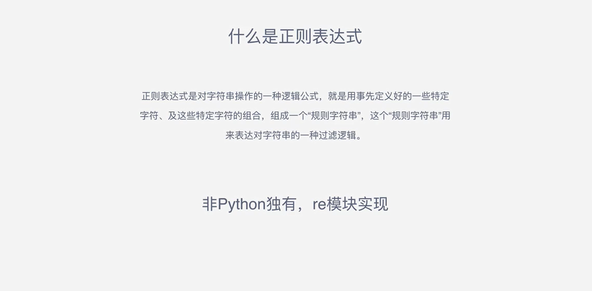
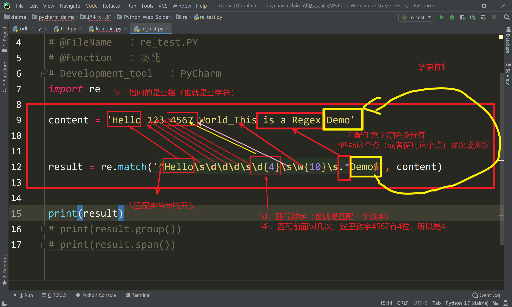
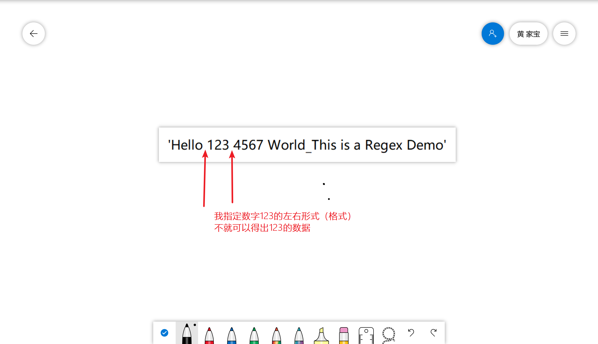
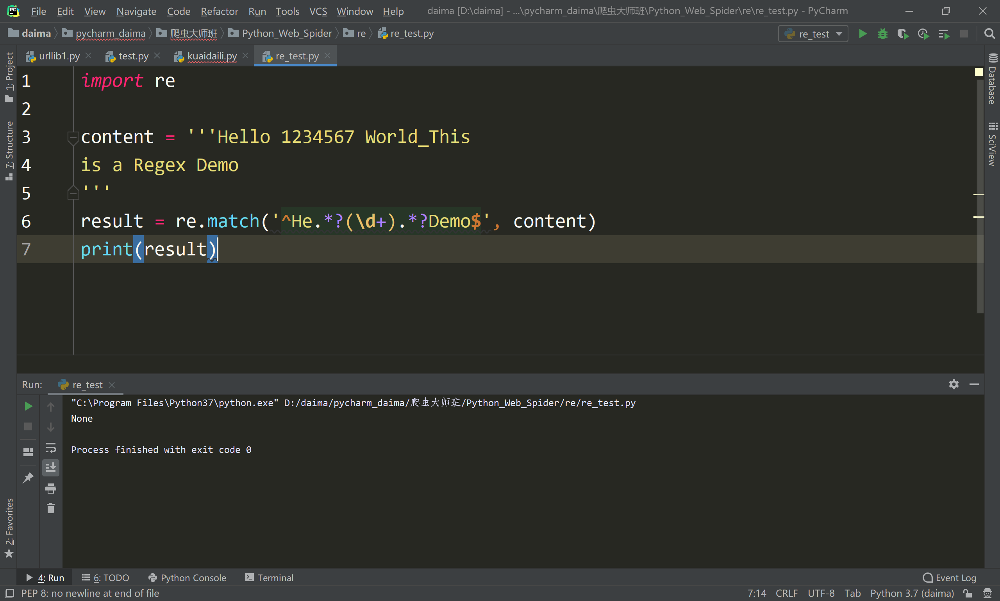

我们接下来看一下什么是正则表达式，什么时候用到正则表达式。

那这里我们打开一个在线正则表达式的一个网站也就是在线正则表达式测试，那在这里我写了一些字符串，（网址、QQ号、邮箱、邮编、字符串、电话号）那我们可以在下面写一些正则表达式就可以匹配了。

那在右边呢，就是一些常用的正则表达式，我们可以直接点击然后匹配我们的字符串。

> ##### 常用正则表达式的方法
>
> - re.compile(编译)
> - pattern.match(从头匹配)
> - pattern.search(匹配一个，扫描所有)
> - pattern.findall(匹配所有)
> - pattern.sub(替换)

## 1.常见匹配模式

| 模式     | 描述                                                         |
| -------- | ------------------------------------------------------------ |
| `\w`     | 匹配字母、数字、下划线                                       |
| `\W`     | 匹配非字母、数字、下划线                                     |
| `\s`     | 匹配任意空白字符，等价于 [\t\n\r\f].                         |
| `\S`     | 匹配任意非空字符                                             |
| `\d`     | 匹配任意数字，等价于 [0-9]                                   |
| `\D`     | 匹配任意非数字                                               |
| `\A`     | **匹配字符串开始**                                           |
| `\Z`     | 匹配字符串结束，如果是存在换行，只匹配到换行前的结束字符串   |
| `\z`     | 匹配字符串结束                                               |
| `\G`     | 匹配最后匹配完成的位置                                       |
| `\n`     | 匹配一个换行符                                               |
| `\t`     | 匹配一个制表符                                               |
| `^`      | **匹配一行字符串的开头**注意区分 **\A 匹配字符串开始**       |
| `$`      | 匹配字符串的末尾。                                           |
| `.`      | 匹配任意字符，除了换行符，当re.DOTALL标记被指定时，则可以匹配包括换行符的任意字符。 |
| `[...]`  | 用来表示一组字符,单独列出：[amk] 匹配 'a'，'m'或'k'          |
| `[^...]` | 不在[]中的字符：[^abc] 匹配除了a,b,c之外的字符。             |
| `*`      | 匹配0个或多个的表达式。                                      |
| `+`      | 匹配1个或多个的表达式。                                      |
| `?`      | 匹配0个或1个由前面的正则表达式定义的片段，非贪婪方式         |
| `{n}`    | 精确匹配n个前面表达式。                                      |
| `{n, m}` | 匹配 n 到 m 次由前面的正则表达式定义的片段，贪婪方式         |
| `a\|b`   | 匹配a或b                                                     |
| `( )`    | 匹配括号内的表达式，也表示一个组                             |

## 2. 详解

### 2.1 re.match

**`re.match`** 尝试从字符串的起始位置匹配一个模式，如果不是起始位置匹配成功的话，**match()** 就返回 **none**。

 ```python
re.match(pattern, string, flags=0)
 ```

#### 2.1.1 最常规的匹配

```python
import re

content = 'Hello 123 4567 World_This is a Regex Demo'
print(len(content))
result = re.match('^Hello\s\d\d\d\s\d{4}\s\w{10}.*Demo$', content)
print(result)# 输出匹配结果
print(result.group())# 获取匹配的内容（匹配的结果）
print(result.span())# 获取匹配的长度

# 输出
41
<re.Match object; span=(0, 41), match='Hello 123 4567 World_This is a Regex Demo'>
Hello 123 4567 World_This is a Regex Demo
(0, 41)

```



上面的匹配是最常规的匹配，写了很长的正则表达式。这样的正则表达式通用性也不强，这时候刚刚燃气对正则表达式的好感又有点小慌，那咋办？别急，下面继续看。

Ps: 上面的正则表达式还可以这么写：

```python
import re

content = 'Hello 123 4567 World_This is a Regex Demo'
# pattern = '^H\w+\s\d{3}\s\d{4}\s\w+\s\w+\s\w\s\w+\sDemo$'
# pattern = '^Hello\s\d\d\d\s\d{4}\s\w{10}.*Demo$'
pattern = '^Hello\s\d\d\d\s\d{4}\s\w{10}.+Demo$'

res = re.match(pattern=pattern, string=content)
print(res)
```

这个时候有同学会问，那我是用 ``.*`` 好呢，还是用 ``.+`` 好呢？

我个人觉得使用 ``.*`` 较为稳妥，因为，``.`` 是匹配任意字符，这两个最主要的区别在于 `*` 与 `+` 前者是匹配零个或 1 个，后者是匹配 1 个或多个，那有时候为了代码更加强壮，显然是前者—— ``.*`` （这样说法其实也不是非常严谨，看具体使用）

不过有这几点你得注意：

- `.*` 这种容错率大

- `.` 很少与量词符同时出现

- 不过大部分的需求，不是什么都匹配，会有很多特殊情况（一般这样 `[^]*`  `[\^]+`，`[\^]` 在中括号里写不想匹配的字符，不匹配所有的）

- 扩展


```python
[+-]?(?:\d*\.|)\d+(?:[eE][+-]?\d+|)  匹配有效数字的
^(?:\s*(<[\w\W]+>)[^>]*$ 匹配 html 标签的
^(?:\s*(<[\w\W]+>)[^>]*$ 匹配 html 标签的
```


#### 2.1.2 泛匹配

上面，我给大家简单的演示了一下最常规的匹配，我们观察上面写的正则表达式会发现，我们原先的正则表达式显得繁琐且通用性也不强，那么有个非常好的方法，就是用刚才我们所用的的 `.*` 来匹配所有的字符串。

上面我们使用到了“**`.*`**" 匹配任意字符，零次或多次。接下来，我就使用这个方法来匹配。

`'^Hello.*Demo$'` 那么我们把中间所有的结果匹配出来了。

```python
import re

content = 'Hello 123 4567 World_This is a Regex Demo'
result = re.match('^Hello.*Demo$', content)
print(result)
print(result.group())
print(result.span())

# 输出
<_sre.SRE_Match object; span=(0, 41), match='Hello 123 4567 World_This is a Regex Demo'>
Hello 123 4567 World_This is a Regex Demo
(0, 41)
```

那我们接下来，如何获取匹配目标呢？（也就是指定匹配目标）

比如，我就要字符串 **content** 中的 **123** 该怎么匹配呢？

#### 2.1.3 匹配目标

一个思路就是，你要知道一个位置，如果两边已经指定知道，那这个位置的数据不就知道了？

为了方便理解，我画一草图：



```python
import re

content = 'Hello 123 4567 World_This is a Regex Demo'
result = re.match('^Hello\s(\d+)\s4567.*Demo$', content)
# 指定左右空格 \s
print(result)
print(result.group(1))
# 如果有两个括号指定，那就是result.group(n)  >>> n 你说的数据
print(result.span())

# 输出
<re.Match object; span=(0, 41), match='Hello 123 4567 World_This is a Regex Demo'>
123
(0, 41)
```


#### 2.1.4 贪婪匹配

```python
import re

content = 'Hello 1234567 World_This is a Regex Demo'
result = re.match('^He.*(\d+).*Demo$', content)
# 我们直接使用 .* 来匹配字符串，然后中间使用(\d+)来匹配我们的目标字符串，最后再使用 .* 匹配剩余的字符，（Dome然后$结束符）
print(result)
print(result.group(1))

# 输出
<_sre.SRE_Match object; span=(0, 40), match='Hello 1234567 World_This is a Regex Demo'>
7

# (\d+) 匹配至少一个
# 从结果上看，我们可以知道，
# 1. 在正则表达式执行的规则时，他发现他后面还有个匹配数字的规则（\d+）
# 2. 那这个：.* 在匹配的时候，就会实现这样一个效果：因为 .* 很贪婪，但又不得不给后面留有匹配的资源（字符）最终贪婪的（.*）就决定留一个给他匹配就好。
# 3. 也就是尽可能多的匹配
```

按原来的想法，应该输出的结果是：**1234567 ，**不过实际却是：**7**，同学们是不是这么想的。

但是呢，看到这个运行结果，它只是把这个 **7** 匹配出来了，也就是说：它前面的 **123456** 被这个 `.* ` 完全的匹配掉了，那其实也就是说：这个 `.* ` 会依次的进行匹配而它会匹配尽可能多的字符。

我们可以看到，它前面有点星就会直接匹配到 123456，后面有  `\d+` 也就是说至少要有一个数字。所它就会把 `\d` 匹配成一个 7 。（Point：`.*` 匹配尽可能地多，直到匹配不到为止！）

这也就是我们所说的**贪婪匹配**。

那小伙伴有没有注意到，如果把上面贪婪匹配中，括号内的**`(\d+)`** 修改成 **`(\d*)`** 输出结果会这样？

```python
import re

content = 'Hello 1234567 World_This is a Regex Demo'
result = re.match('^Hello.*(\d*).*Demo$', content)
# 我们直接使用 .* 来匹配字符串，然后中间使用(\d*)来匹配我们的目标字符串，最后再使用 .* 匹配剩余的字符，（Dome然后$结束符）
print(result)
print(result.group(1))

# 输出
<re.Match object; span=(0, 40), match='Hello 1234567 World_This is a Regex Demo'>


```

那改成就一个**`(\d)`** 呢？

```python
import re

content = 'Hello 1234567 World_This is a Regex Demo'
result = re.match('^Hello.*(\d).*Demo$', content)
# 我们直接使用 .* 来匹配字符串，然后中间使用(\d)来匹配我们的目标字符串，最后再使用 .* 匹配剩余的字符，（Dome然后$结束符）
print(result)
print(result.group(1))

# 输出
<re.Match object; span=(0, 40), match='Hello 1234567 World_This is a Regex Demo'>
7

```

**具体感受还是要靠你自己敲代码感受感受，我说出来，并不能然你灵活运用和理解。我能做的就是引导。**

我们接下来来看一下非贪婪模式的匹配，非贪婪匹配我们可以在这个 `.*` 后面加一个 `?`。

#### 2.1.5 非贪婪匹配

```python
import re
# .*? 尽可能少的匹配
# 以下代码自己修改多运行几次就知道了
content = 'Hello 1234567 World_This is a Regex Demo'
result = re.match('^He.*?(\d+).*Demo$', content)
print(result)
print(result.group(1))

# 输出
<_sre.SRE_Match object; span=(0, 40), match='Hello 1234567 World_This is a Regex Demo'>
1234567

```

我们运行一下，那这里我们可以看到运行的结果就是 **1234567** 了，那这是为什么呢？

那这个问号就会指定这个模式为非贪婪匹配，也就是说匹配尽可能少的字符。那你看这个问号之后有这个 `\d+` 也就是说它开始匹配数字了。那当他开始匹配的时候如果看到它后面**是一个数字**，它就把**前面的直接停止匹配**。那这样的话 `.*?` 匹配 `llo ` ，然后这个 `\d+` 就会匹配到 **1234567** ，那这个 `.*?` 指定为非贪婪，匹配尽可能少的字符。这样我们就能看到匹配效果，也就是我们想要的一种匹配效果，也就是匹配 **1234567**，那这样的话，我们可以使用非贪婪模式。把前面无关的字符用 `.*?`  来匹配，后面加上我们的匹配目标，这样我们就可以非常方便的把我们的匹配目标获取出来了。那这种效果就是我们想要的。

那把加号去掉呢？

```python
# 那把加号去掉呢？
import re
# ?	匹配0个或1个由前面的正则表达式定义的片段，非贪婪方式
content = 'Hello 1234567 World_This is a Regex Demo'
result = re.match('^Hello\s.*?(\d).*Demo$', content)
print(result)
print(result.group(1))

# 输出
<re.Match object; span=(0, 40), match='Hello 1234567 World_This is a Regex Demo'>
1

# 那连续两个非贪婪匹配呢？
import re
# ?	匹配0个或1个由前面的正则表达式定义的片段，非贪婪方式
content = 'Hello 1234567 World_This is a Regex Demo'
result = re.match('^Hello\s.*?.*?(\d).*Demo$', content)
print(result)
print(result.group(1))

# 输出
<re.Match object; span=(0, 40), match='Hello 1234567 World_This is a Regex Demo'>
1

# 看结果看来真的是非贪婪呀，就匹配一个空字符
```

**提示：** 按这样来看，可以使用 **`.*?`** 来指定一个格式，只要非贪婪匹配后面跟着某个特定规则（例如(`\d`)），一碰到满足的，**`.*?`** 就直接停止匹配。

>解析：
>
>**`.*`** ：尽可能多的匹配（贪）
>
>​	**`.`**（点） ： 匹配任意字符，除了换行符
>
>​	**`*`**（星号）：匹配0次或者多次，这里的多次就是很多次（不限匹配次数）
>
>​	**`.*`** ： 连起来就是，匹配表达式：**.（点）** 的次数（也就是0次或多次）

> **`.*?`** ：尽可能少的匹配（懒）
>
> 上面已经解析我就不重复解析：
>
> **`?`** ：匹配次数只有 0 次或者 1 次（这就非常好理解了）


#### 2.1.6 匹配模式



```python
# 由上面的图片我们可以知道，返回的是 None。为什么呢？因为 . (点).	匹配任意字符，除了换行符，当re.DOTALL标记被指定时，则可以匹配包括换行符的任意字符。
# 接下来指定一下匹配模式即可
import re

content = '''Hello 1234567 World_This
is a Regex Demo
'''
result = re.match('^He.*?(\d+).*?Demo$', content, re.S)
print(result.group(1))
```

```
1234567
```

那接下来我们顺便把上面的 `*` 改成 `+` 观察一下以下代码：

```python
# 一
import re

content = '''Hello 1234567 World_This
is a Regex Demo
'''
result = re.match('^Hello.+?(\d+).*Demo$', content, re.S)
# 这里面的 .+? 把空格匹配走了，那下面加个 \s 我们继续观察一下
print(result.group(1))
# 输出
1234567

# 二
import re

content = '''Hello 1234567 World_This
is a Regex Demo
'''
result = re.match('^Hello\s.+?(\d+).*Demo$', content, re.S)
print(result.group(1))
# 输出
234567

# 三
import re

content = '''Hello 1234567 World_This
is a Regex Demo
'''
result = re.match('^Hello\s.*?(\d+).*Demo$', content, re.S)
print(result.group(1))
# 输出
1234567
```

**总结：**

点代表匹配任意字符除换行符，星号是匹配前面的表达式的零次或多次（也就是说：最少可以一次都不匹配，当然在条件允许的情况下，可以匹配多次），而加号就是表达：匹配一次或者多次（也就是说：至少要匹配一个数字，当然在条件允许的情况下，可以匹配多次）


> ( `'a'`, `'i'`, `'L'`, `'m'`, `'s'`, `'u'`, `'x'` 中的一个或多个) 这个组合匹配一个空字符串；
>
> 1. 这些字符对正则表达式设置以下标记
> 2.  [`re.A`](https://docs.python.org/zh-cn/3/library/re.html#re.A) (只匹配ASCII字符),
> 3. [`re.I`](https://docs.python.org/zh-cn/3/library/re.html#re.I) (忽略大小写),
> 4.  [`re.L`](https://docs.python.org/zh-cn/3/library/re.html#re.L) (语言依赖),
> 5.  [`re.M`](https://docs.python.org/zh-cn/3/library/re.html#re.M) (多行模式),
> 6.  [`re.S`](https://docs.python.org/zh-cn/3/library/re.html#re.S) (点（dot）匹配全部字符( (点匹配所有字符)),
> 7.  `re.U` (Unicode匹配), and [`re.X`](https://docs.python.org/zh-cn/3/library/re.html#re.X) (冗长模式)。
> 8.  (这些标记在 [模块内容](https://docs.python.org/zh-cn/3/library/re.html#contents-of-module-re) 中描述) 如果你想将这些标记包含在正则表达式中，这个方法就很有用，免去了在 [`re.compile()`](https://docs.python.org/zh-cn/3/library/re.html#re.compile) 中传递 *flag* 参数。标记应该在表达式字符串首位表示。

---

| 匹配模式名称 | 匹配含义                                                     |
| ------------ | ------------------------------------------------------------ |
| `re.A`       | 只匹配 ASCII 字符                                            |
| `re.I`       | 忽略大小写                                                   |
| `re.L`       | 语言依赖                                                     |
| `re.M`       | 多行模式                                                     |
| `re.S`       | 匹配所有字符                                                 |
| `re.U`       | (Unicode匹配), and [`re.X`](https://docs.python.org/zh-cn/3/library/re.html#re.X) (冗长模式)。 |


#### 2.1.7 转义

```python
import re

content = 'price is $5.00'
result = re.match('price is $5.00', content)
print(result)
```

```
None
```

```python
import re

content = 'price is $5.00'
result = re.match('price is \$5\.00', content)
print(result)
```

```
<_sre.SRE_Match object; span=(0, 14), match='price is $5.00'>
```

那到这里，我们把正则表达式里面最常见的用法介绍完了，那么总结一下：

**总结：尽量使用泛匹配、使用括号得到匹配目标、尽量使用非贪婪模式、有换行符就用 `re.S`**（如果，在匹配的时候遇见特别长的字符，我们就可以使用 `.*` 来匹配，但是贪婪模式会导致我们少一些字符）

**`re.match`：的缺点，就是他是从头开始匹配的，如果第一个不匹配的话，就无法执行了** 这个是比较不方便的。

那 re 模块还有 `re.search()` ，这个方法它会直接搜索整个字符串，那如果有你写的正则表达式的话，它就会直接返回。

### 2.2 re.search

**`re.search` 扫描整个字符串并返回第一个成功的匹配。**

```python
import re

content = 'Extra stings Hello 1234567 World_This is a Regex Demo Extra stings'
result = re.match('Hello.*?(\d+).*?Demo', content)
print(result)

# 输出
None

# match只有开头匹配成功，才能正确匹配完成

import re

content = 'Hello 1234567 World_This is a Regex Demo Extra stings'
result = re.match('Hello.*?(\d+).*?Demo', content)
print(result)

# 输出
<re.Match object; span=(0, 40), match='Hello 1234567 World_This is a Regex Demo'>
```

**search**

```python
import re

content = 'Extra stings Hello 1234567 World_This is a Regex Demo Extra stings'
result = re.search('Hello.*?(\d+).*?Demo', content)
print(result)
print(result.group(1))

# 输出
<_sre.SRE_Match object; span=(13, 53), match='Hello 1234567 World_This is a Regex Demo'>
1234567
```

**总结：为匹配方便，能用 search 就不用 match**

**在 search 匹配中慎重使用 `^$` **

**你看下面的代码示例，看正则表达式有没有问题**

```python
import re

content = 'Extra stings Hello 1234567 World_This is a Regex Demo Extra stings'

result = re.search('^Hello.*?(\d+).*?Demo$', content)
print(result)
# 你看上面的正则式，输出结果会是怎样的呢？不要着急看结果，自己试一试才能理解的更快。


# 输出
None
```

这时候，你会不会发现，哎？

我写对了鸭！为啥会是输出 **None**

会不会是 **Demo 问题？** 那把 **Demo后面的 $ 去掉试一试！**

```python
import re

content = 'Extra stings Hello 1234567 World_This is a Regex Demo Extra stings'

result = re.search('^Hello.*?(\d+).*?Demo', content)
print(result)

# 输出
None
```

**What?**

那咱们把 **`^`** 去掉呢？

```python
import re

content = 'Extra stings Hello 1234567 World_This is a Regex Demo Extra stings'

result = re.search('Hello.*?(\d+).*?Demo', content)
print(result)

# 输出
<re.Match object; span=(13, 53), match='Hello 1234567 World_This is a Regex Demo'>
```

可以了，不过，你有可能会有疑问，在 **search 不能加 `^ $`**？

咱们把代码修改一下：

```python
import re

content = 'Hello 1234567 World_This is a Regex Demo'

result = re.search('^Hello.*?(\d+).*?Demo$', content)
print(result)

# 输出
<re.Match object; span=(0, 40), match='Hello 1234567 World_This is a Regex Demo'>
```

貌似可以鸭，其他的自行修改感受。

#### 2.2.1 匹配演练

1.提取：**齐秦 往事随风**

```python
import re

html = '''<div id="songs-list">
    <h2 class="title">经典老歌</h2>
    <p class="introduction">
        经典老歌列表
    </p>
    <ul id="list" class="list-group">
        <li data-view="2">一路上有你</li>
        <li data-view="7">
            <a href="/2.mp3" singer="任贤齐">沧海一声笑</a>
        </li>
        <li data-view="4" class="active">
            <a href="/3.mp3" singer="齐秦">往事随风</a>
        </li>
        <li data-view="6"><a href="/4.mp3" singer="beyond">光辉岁月</a></li>
        <li data-view="5"><a href="/5.mp3" singer="陈慧琳">记事本</a></li>
        <li data-view="5">
            <a href="/6.mp3" singer="邓丽君"><i class="fa fa-user"></i>但愿人长久</a>
        </li>
    </ul>
</div>'''
result = re.search('<li.*?active.*?singer="(.*?)">(.*?)</a>', html, re.S)
if result:
    print(result.group(1), result.group(2))
	# print(result.group(1, 2))    
```

```
齐秦 往事随风
```


```python
import re

html = '''<div id="songs-list">
    <h2 class="title">经典老歌</h2>
    <p class="introduction">
        经典老歌列表
    </p>
    <ul id="list" class="list-group">
        <li data-view="2">一路上有你</li>
        <li data-view="7">
            <a href="/2.mp3" singer="任贤齐">沧海一声笑</a>
        </li>
        <li data-view="4" class="active">
            <a href="/3.mp3" singer="齐秦">往事随风</a>
        </li>
        <li data-view="6"><a href="/4.mp3" singer="beyond">光辉岁月</a></li>
        <li data-view="5"><a href="/5.mp3" singer="陈慧琳">记事本</a></li>
        <li data-view="5">
            <a href="/6.mp3" singer="邓丽君">但愿人长久</a>
        </li>
    </ul>
</div>'''
result = re.search('<li.*?singer="(.*?)">(.*?)</a>', html, re.S)
if result:
    print(result.group(1), result.group(2))
```

```
任贤齐 沧海一声笑
```


```python
import re

html = '''<div id="songs-list">
    <h2 class="title">经典老歌</h2>
    <p class="introduction">
        经典老歌列表
    </p>
    <ul id="list" class="list-group">
        <li data-view="2">一路上有你</li>
        <li data-view="7">
            <a href="/2.mp3" singer="任贤齐">沧海一声笑</a>
        </li>
        <li data-view="4" class="active">
            <a href="/3.mp3" singer="齐秦">往事随风</a>
        </li>
        <li data-view="6"><a href="/4.mp3" singer="beyond">光辉岁月</a></li>
        <li data-view="5"><a href="/5.mp3" singer="陈慧琳">记事本</a></li>
        <li data-view="5">
            <a href="/6.mp3" singer="邓丽君">但愿人长久</a>
        </li>
    </ul>
</div>'''
result = re.search('<li.*?singer="(.*?)">(.*?)</a>', html)
if result:
    print(result.group(1), result.group(2))
    
# 输出
beyond 光辉岁月
```

上面的 `search() `方法是查询一个结果，而接下来的 `findall()` 是查询符合条件的所有结果的。

### 2.3 re.findall

搜索字符串，以列表形式返回全部能匹配的子串。

```python
import re

html = '''<div id="songs-list">
    <h2 class="title">经典老歌</h2>
    <p class="introduction">
        经典老歌列表
    </p>
    <ul id="list" class="list-group">
        <li data-view="2">一路上有你</li>
        <li data-view="7">
            <a href="/2.mp3" singer="任贤齐">沧海一声笑</a>
        </li>
        <li data-view="4" class="active">
            <a href="/3.mp3" singer="齐秦">往事随风</a>
        </li>
        <li data-view="6"><a href="/4.mp3" singer="beyond">光辉岁月</a></li>
        <li data-view="5"><a href="/5.mp3" singer="陈慧琳">记事本</a></li>
        <li data-view="5">
            <a href="/6.mp3" singer="邓丽君">但愿人长久</a>
        </li>
    </ul>
</div>'''
results = re.findall('<li.*?href="(.*?)".*?singer="(.*?)">(.*?)</a>', html, re.S)
print(results)
print(type(results))
for result in results:
    print(result)
    print(result[0], result[1], result[2])
```

```html
[('/2.mp3', '任贤齐', '沧海一声笑'), ('/3.mp3', '齐秦', '往事随风'), ('/4.mp3', 'beyond', '光辉岁月'), ('/5.mp3', '陈慧琳', '记事本'), ('/6.mp3', '邓丽君', '但愿人长久')]
<class 'list'>
('/2.mp3', '任贤齐', '沧海一声笑')
/2.mp3 任贤齐 沧海一声笑
('/3.mp3', '齐秦', '往事随风')
/3.mp3 齐秦 往事随风
('/4.mp3', 'beyond', '光辉岁月')
/4.mp3 beyond 光辉岁月
('/5.mp3', '陈慧琳', '记事本')
/5.mp3 陈慧琳 记事本
('/6.mp3', '邓丽君', '但愿人长久')
/6.mp3 邓丽君 但愿人长久
```

从上面的代码，看起来没有问题，正常的匹配。但是，细心的你会发现，我们匹配的是从第二个开始的。那我该如何匹配全部呢？（Ps：因为第一个里面没有 href 标签）

```python
import re

html = '''<div id="songs-list">
    <h2 class="title">经典老歌</h2>
    <p class="introduction">
        经典老歌列表
    </p>
    <ul id="list" class="list-group">
        <li data-view="2">一路上有你</li>
        <li data-view="7">
            <a href="/2.mp3" singer="任贤齐">沧海一声笑</a>
        </li>
        <li data-view="4" class="active">
            <a href="/3.mp3" singer="齐秦">往事随风</a>
        </li>
        <li data-view="6"><a href="/4.mp3" singer="beyond">光辉岁月</a></li>
        <li data-view="5"><a href="/5.mp3" singer="陈慧琳">记事本</a></li>
        <li data-view="5">
            <a href="/6.mp3" singer="邓丽君">但愿人长久</a>
        </li>
    </ul>
</div>'''

# <li 标签开头来写一下，然后再把li的标签结尾写一下。最终的结果就是>>><li.*?>
# 接下来，我们要考虑的是换行不换行的问题了，为什么这么说呢？因为，你认真观察 html 字符串会发现，有些有换行，有些没有换行（换行：任贤齐、齐秦；不换行：一路有你、beyond、陈慧琳、邓丽君）
# 所以说，我们就在这里加一个 \s 加一个空白字符，但这个空白字符可能有可能没有，所以，我们加一个 *? (* 表示可能有0个或多个空白字符，？代表有还是没有（也就是0或1）)
# 接下来，我们再写一下这个 a 标签，那这个 a标签可能有，也可能没有。
# 所以，我们给 a 标签加个括号，因为括号加起来是个整体（开头有写），又因为，这个 a 标签有可能有，也有可能没有，所以也在括号后面加个 ？即可。
# 最后，会看到最后的 </li> 标签有些有换行，有些没有换行。所以，我们使用 \s*? 来编写，结尾就是：</li>
results = re.findall('<li.*?>\s*?(<a.*?>)?(\w+)(</a>)?\s*?</li>', html, re.S)
# results = re.findall('<li.*?>\s*?(<a.*?singer="(\w+)">)?(\w+)(</a>)?\s*?</li>', html, re.S)

print(results)
for result in results:
    print(result[1])
```

**(`* `表示可能有 0 个或多个空白字符，？代表有还是没有（也就是 0 或 1 ）)**

```HTML
[('', '一路上有你', ''), ('<a href="/2.mp3" singer="任贤齐">', '沧海一声笑', '</a>'), ('<a href="/3.mp3" singer="齐秦">', '往事随风', '</a>'), ('<a href="/4.mp3" singer="beyond">', '光辉岁月', '</a>'), ('<a href="/5.mp3" singer="陈慧琳">', '记事本', '</a>'), ('<a href="/6.mp3" singer="邓丽君">', '但愿人长久', '</a>')]
一路上有你
沧海一声笑
往事随风
光辉岁月
记事本
但愿人长久
```

这时候有同学想到：为什么不能用 `\n` 来匹配换行呢？

```python
results = re.findall('<li.*?>\n?(<a.*?>)?(\w+)(</a>)?\n?</li>', html)
# 这样是不行的，
# 1. \n不能匹配空格
# 2. li后面除了换行距离下一个a标签还有一段空格的
# 3. \s是匹配空白字符，所以\n也会被匹配
# 4. 上面那条正则才没问题
print(results)
```

- `?`和 `+*` 这些组合就是控制贪婪性的（单个使用时匹配 0 次或 1 次）
- `(aaa)?` 这样使用时控制 aaa 出现 0 次或 1 次

```python
import re

html = '''<div id="songs-list">
    <h2 class="title">经典老歌</h2>
    <p class="introduction">
        经典老歌列表
    </p>
    <ul id="list" class="list-group">
        <li data-view="2">一路上有你</li>
        <li data-view="7">
            <a href="/2.mp3" singer="任贤齐">沧海一声笑</a>
        </li>
        <li data-view="4" class="active">
            <a href="/3.mp3" singer="齐秦">往事随风</a>
        </li>
        <li data-view="6"><a href="/4.mp3" singer="beyond">光辉岁月</a></li>
        <li data-view="5"><a href="/5.mp3" singer="陈慧琳">记事本</a></li>
        <li data-view="5">
            <a href="/6.mp3" singer="邓丽君">但愿人长久</a>
        </li>
    </ul>
</div>'''
# results = re.findall('<li.*?>\s*?(<a.*?>)?(\w+)(</a>)?\s*?</li>', html, re.S)
results = re.findall('<li.*?>\s*(?:<a.*?singer="(\w+)">)?(\w+)(?:</a>)?\s*</li>', html, re.S)
# results = re.findall('<li.*?>(\s*)?(<a.*?>)?(\w+)(</a>)?(\s*)?</li>', html, re.S)
# results = re.findall('<li.*?>\n?(<a.*?>)?(\w+)(</a>)?\n?</li>', html, re.S)
# 这样是不行的，
# 1. \n不能匹配空格
# 2. li后面除了换行距离下一个a标签还有一段空格的
# 3. \s是匹配空白字符，所以\n也会被匹配
# 4. 上面那条正则才没问题
print(results)
for result in results:
	# 方法一
	# print(*result)
	# 方法二
	if result[0] or result[1]:
	# if result[0] or result[1] is not None: 等价上面的表示方法
		print(result[0],result[1])
	# if result[0]:# 直接把 一路有你去掉了，不行！
	# 	print(result[0],result[1])

```

**匹配不捕获 `?:`**

### 2.4 选择与反向引用

#### 2.4.1 选择

用圆括号将所有选择项括起来，相邻的选择项之间用|分隔。但用圆括号会有一个副作用，使相关的匹配会被缓存，此时可用?:放在第一个选项前来消除这种副作用。

其中 `?:` 是非捕获元之一，还有两个非捕获元是`?=` 和 `?!`，这两个还有更多的含义，前者为正向预查，在任何开始匹配圆括号内的正则表达式模式的位置来匹配搜索字符串，后者为负向预查，在任何开始不匹配该正则表达式模式的位置来匹配搜索字符串。

#### 2.4.2 反向引用

对一个正则表达式模式或部分模式两边添加圆括号将导致相关匹配存储到一个临时缓冲区中，所捕获的每个子匹配都按照在正则表达式模式中从左到右出现的顺序存储。缓冲区编号从 1 开始，最多可存储 99 个捕获的子表达式。每个缓冲区都可以使用 `\n` 访问，其中 n 为一个标识特定缓冲区的一位或两位十进制数。

可以使用非捕获元字符 `?:`、`?=` 或 `?!` 来重写捕获，忽略对相关匹配的保存。

反向引用的最简单的、最有用的应用之一，是提供查找文本中两个相同的相邻单词的匹配项的能力。以下面的句子为例：

```python
Is is the cost of of gasoline going up up?
```

上面的句子很显然有多个重复的单词。如果能设计一种方法定位该句子，而不必查找每个单词的重复出现，那该有多好。下面的正则表达式使用单个子表达式来实现这一点：


### 2.4 re.sub

替换字符串中每一个匹配的子串后返回替换后的字符串。

`re.sub(正则表达式, 你要替换的成的字符串，修改对象：字符串)`

```python
import re

content = 'Extra stings Hello 1234567 World_This is a Regex Demo Extra stings'
content = re.sub('\d+', '', content)
print(content)

# 输出
Extra stings Hello  World_This is a Regex Demo Extra stings

# 测试二
import re

content = 'Extra stings Hello 1234567 World_This 1234567 is a Regex Demo Extra stings'
content = re.sub('\d+', '', content)
print(content)
# 输出
Extra stings Hello  World_This  is a Regex Demo Extra stings

# 测试三
import re

content = 'Extra stings Hello 1234567 World_This is 2333333 a Regex Demo Extra stings'
results = re.sub('\d+', 'love', content)
print(results)

# 输出
Extra stings Hello love World_This is love a Regex Demo Extra stings

# 测试四：
import re

content = 'Extra stings Hello 1234567 World_This is a Regex Demo Extra stings'
content = re.sub('\d+', 'Replacement', content)
print(content)

# 输出
Extra stings Hello Replacement World_This is a Regex Demo Extra stings

# # 测试五：
import re

content = 'Extra stings Hello 1234567 World_This is 2333333 a Regex Demo Extra stings'
results = re.sub('\d+', 'love', content, count=1)
print(results)
# 输出
Extra stings Hello love World_This is 2333333 a Regex Demo Extra stings

# 测试 六
import re

content = 'Extra stings Hello 1234567 World_This is 2333333 a Regex Demo Extra stings'
results = re.sub('\d', 'love', content)
print(results)
# 输出
Extra stings Hello lovelovelovelovelovelovelove World_This is lovelovelovelovelovelovelove a Regex Demo Extra stings
```

那，现在问题来了。

如果我们要替换的字符串目标是原字符串本身或者说包含原字符串。该怎么办呢？（就是替换了，原来的字符串还在。添加数字之类的......)

那这里我们可以把**匹配的正则表达式加一个括号**，表示一个整体并且我们还可以通过 **Group()** 来获取。(所以可以用 **反斜杠 ``\1 ``来拿到这个字符，来进行字符串之后的操作，又因为这个反斜杠 1 是转义字符，所以需要加个 r 就是禁止转义更加（保持）原生。** )

```python
import re

content = 'Extra stings Hello 1234567 World_This is a Regex Demo Extra stings'
content = re.sub('(\d+)', r'\1 8910', content)
print(content)

# 输出
Extra stings Hello 1234567 8910 World_This is a Regex Demo Extra stings
```

在前面的的例子中，也就是下面的例子：

为了方便学习，我也把他写在下面了。

原先我们的正则表达式，写了 **`\s*?`** 是否有空白字符或换行的操作，**是否有超链接的判断**

```python
import re

html = '''<div id="songs-list">
    <h2 class="title">经典老歌</h2>
    <p class="introduction">
        经典老歌列表
    </p>
    <ul id="list" class="list-group">
        <li data-view="2">一路上有你</li>
        <li data-view="7">
            <a href="/2.mp3" singer="任贤齐">沧海一声笑</a>
        </li>
        <li data-view="4" class="active">
            <a href="/3.mp3" singer="齐秦">往事随风</a>
        </li>
        <li data-view="6"><a href="/4.mp3" singer="beyond">光辉岁月</a></li>
        <li data-view="5"><a href="/5.mp3" singer="陈慧琳">记事本</a></li>
        <li data-view="5">
            <a href="/6.mp3" singer="邓丽君">但愿人长久</a>
        </li>
    </ul>
</div>'''

# <li 标签开头来写一下，如何再把li的标签结尾写一下。最终的结果就是>>><li.*?>
# 接下来，我们要考虑的是换行不换行的问题了，为什么这么说呢？因为，你认真观察 html 字符串会发现，有些有换行，有些没有换行（换行：任贤齐、齐秦；不换行：一路有你、beyond、陈慧琳、邓丽君）
# 所以说，我们就在这里加一个 \s 加一个空白字符，但这个空白字符可能有可能没有，所以，我们加一个 *? (* 表示可能有0个或多个空白字符，？代表有还是没有（也就是0或1）)
# 接下来，我们再写一下这个 a 标签，那这个 a标签可能有，也可能没有。
# 所以，我们给 a 标签加个括号，因为括号加起来是个整体（开头有写），又因为，这个 a 标签有可能有，也有可能没有，所以也在括号后面加个 ？即可。
# 最后，会看到最后的 </li> 标签有些有换行，有些没有换行。所以，我们使用 \s*? 来编写，结尾就是：</li>
results = re.findall('<li.*?>\s*?(<a.*?>)?(\w+)(</a>)?\s*?</li>', html, re.S)
# results = re.findall('<li.*?>\s*?(<a.*?singer="(\w+)">)?(\w+)(</a>)?\s*?</li>', html, re.S)

print(results)
for result in results:
    print(result[1])
```

那我们有了这个 **`re.sub()`** 方法，我们就先用一个正则表达式替换。然后把刚才的 a 标签完全替换掉（也就可以把 a 标签完全替换掉）之后就可以直接使用 `findall()` 方法来找到 li 标签的内容了。具体操作，继续往下看。

首先，我们使用 **`re.sub()`** 方法替换掉 **a** 标签,替换成空字符：>>> `re.sub('<a.*?>|\</a>', '', html)`

这里，你有可能就会有疑问，为什么要使用中间的这个符号：`|`。在正则表达式中，这个含义不是运算符中的并集。**是或的含义**，最上面开头已经讲过了，希望你在看到这里的时候已经全部记忆下来了。

为了让你或者说，可能是懒惰的你，知道原因，我把操作代码和结果都给你提供，这是其他教程不可能有的，其他教程目的不是让你懂，或者付费教程，而是赚钱都是这样，没有大圣人。唯独的区别就是：我也是想赚钱，但我每一篇都会尽可能的详细，绝不忽悠你任何技术上的问题。

```python
import re

html = '''<div id="songs-list">
    <h2 class="title">经典老歌</h2>
    <p class="introduction">
        经典老歌列表
    </p>
    <ul id="list" class="list-group">
        <li data-view="2">一路上有你</li>
        <li data-view="7">
            <a href="/2.mp3" singer="任贤齐">沧海一声笑</a>
        </li>
        <li data-view="4" class="active">
            <a href="/3.mp3" singer="齐秦">往事随风</a>
        </li>
        <li data-view="6"><a href="/4.mp3" singer="beyond">光辉岁月</a></li>
        <li data-view="5"><a href="/5.mp3" singer="陈慧琳">记事本</a></li>
        <li data-view="5">
            <a href="/6.mp3" singer="邓丽君">但愿人长久</a>
        </li>
    </ul>
</div>'''

results = re.sub('<a.*?></a>', '', html)
# 中间还有其他文字等，所以会匹配不上。
print('没有 | 的结果:>>>', results)

results = re.sub('<a.*?>|</a>', '', html)
# results = re.sub('<a.*?>\w+</a>', '', html) # 为了方便你理解，我也会在下面写出这个操作
# 你也有可能想到这个上面的这个式子,但输出结果会把需要的替换掉
print('有 | 的结果:>>>', results)


# 输出
"C:\Program Files\Python37\python.exe" D:/daima/pycharm_daima/爬虫大师班/Python_Web_Spider/re/re_test.py
没有 | 的结果:>>> <div id="songs-list">
    <h2 class="title">经典老歌</h2>
    <p class="introduction">
        经典老歌列表
    </p>
    <ul id="list" class="list-group">
        <li data-view="2">一路上有你</li>
        <li data-view="7">
            <a href="/2.mp3" singer="任贤齐">沧海一声笑</a>
        </li>
        <li data-view="4" class="active">
            <a href="/3.mp3" singer="齐秦">往事随风</a>
        </li>
        <li data-view="6"><a href="/4.mp3" singer="beyond">光辉岁月</a></li>
        <li data-view="5"><a href="/5.mp3" singer="陈慧琳">记事本</a></li>
        <li data-view="5">
            <a href="/6.mp3" singer="邓丽君">但愿人长久</a>
        </li>
    </ul>
</div>
有 | 的结果:>>> <div id="songs-list">
    <h2 class="title">经典老歌</h2>
    <p class="introduction">
        经典老歌列表
    </p>
    <ul id="list" class="list-group">
        <li data-view="2">一路上有你</li>
        <li data-view="7">
            沧海一声笑
        </li>
        <li data-view="4" class="active">
            往事随风
        </li>
        <li data-view="6">光辉岁月</li>
        <li data-view="5">记事本</li>
        <li data-view="5">
            但愿人长久
        </li>
    </ul>
</div>

Process finished with exit code 0


# 补充
pattern_a_tag = '<a.*?>\w+</a>'
results = re.sub(pattern_a_tag, '', html)
print(results)

# 输出
<div id="songs-list">
    <h2 class="title">经典老歌</h2>
    <p class="introduction">
        经典老歌列表
    </p>
    <ul id="list" class="list-group">
        <li data-view="2">一路上有你</li>
        <li data-view="7">
            
        </li>
        <li data-view="4" class="active">
            
        </li>
        <li data-view="6"></li>
        <li data-view="5"></li>
        <li data-view="5">
            
        </li>
    </ul>
</div>
```

那接下来使用 **`re.findall() `方法就特别方便了** 把 **li** 标签中的歌名提取出来。

```python
import re

html = '''<div id="songs-list">
    <h2 class="title">经典老歌</h2>
    <p class="introduction">
        经典老歌列表
    </p>
    <ul id="list" class="list-group">
        <li data-view="2">一路上有你</li>
        <li data-view="7">
            <a href="/2.mp3" singer="任贤齐">沧海一声笑</a>
        </li>
        <li data-view="4" class="active">
            <a href="/3.mp3" singer="齐秦">往事随风</a>
        </li>
        <li data-view="6"><a href="/4.mp3" singer="beyond">光辉岁月</a></li>
        <li data-view="5"><a href="/5.mp3" singer="陈慧琳">记事本</a></li>
        <li data-view="5">
            <a href="/6.mp3" singer="邓丽君">但愿人长久</a>
        </li>
    </ul>
</div>'''
html = re.sub('<a.*?>|</a>', '', html)
print(html)
results = re.findall('<li.*?>(.*?)</li>', html, re.S) # re.S 匹配换行符
print(results)
# 我们可以看到下面的输出结果，六个歌名都提取出来了，那这个歌名里面你可能会看到有一些换行符。那是因为咱们是直接匹配 li 标签里面的内容，那这个 li 标签中，有的有换行符有的没有换行符，所以结果里面出现了换行符。
for result in results:
    print(result.strip())
    

# 输出
<div id="songs-list">
    <h2 class="title">经典老歌</h2>
    <p class="introduction">
        经典老歌列表
    </p>
    <ul id="list" class="list-group">
        <li data-view="2">一路上有你</li>
        <li data-view="7">
            沧海一声笑
        </li>
        <li data-view="4" class="active">
            往事随风
        </li>
        <li data-view="6">光辉岁月</li>
        <li data-view="5">记事本</li>
        <li data-view="5">
            但愿人长久
        </li>
    </ul>
</div>
['一路上有你', '\n            沧海一声笑\n        ', '\n            往事随风\n        ', '光辉岁月', '记事本', '\n            但愿人长久\n        ']
一路上有你
沧海一声笑
往事随风
光辉岁月
记事本
但愿人长久
```

但是还有一个匹配方式：

```python
import re

html = '''<div id="songs-list">
    <h2 class="title">经典老歌</h2>
    <p class="introduction">
        经典老歌列表
    </p>
    <ul id="list" class="list-group">
        <li data-view="2">一路上有你</li>
        <li data-view="7">
            <a href="/2.mp3" singer="任贤齐">沧海一声笑</a>
        </li>
        <li data-view="4" class="active">
            <a href="/3.mp3" singer="齐秦">往事随风</a>
        </li>
        <li data-view="6"><a href="/4.mp3" singer="beyond">光辉岁月</a></li>
        <li data-view="5"><a href="/5.mp3" singer="陈慧琳">记事本</a></li>
        <li data-view="5">
            <a href="/6.mp3" singer="邓丽君">但愿人长久</a>
        </li>
    </ul>
</div>'''

results = re.sub('<a.*?>|</a>', '', html)

sing_name = re.findall('<li.*?>\s*?(\w+)\s*?</li>', results)
# result = re.findall('<li.*?>(?:\s*)?(\w+)(?:\s*)?</li>', results)
print(sing_name)


# 输出
"C:\Program Files\Python37\python.exe" D:/daima/pycharm_daima/爬虫大师班/Python_Web_Spider/re/re_test.py
['一路上有你', '沧海一声笑', '往事随风', '光辉岁月', '记事本', '但愿人长久']

Process finished with exit code 0

```

### 2.5 re.compile

将正则字符串编译成正则表达式对象

```python
将一个正则表达式串编译成正则对象，以便于复用该匹配模式
```

```python
import re

content = '''Hello 1234567 World_This
is a Regex Demo'''
pattern = re.compile('Hello.*Demo', re.S)
# re.compile('正则表达式', 匹配模式)
result = re.match(pattern, content)
#result = re.match('Hello.*Demo', content, re.S)
print(result)
```

```
<_sre.SRE_Match object; span=(0, 40), match='Hello 1234567 World_This\nis a Regex Demo'>
```

## 3. 实战练习

讲了那么多内容，现在就进入实战演练一下，**是骡子是马，拉出来溜溜。**

**目标：豆瓣**

**目标网址：https://book.douban.com/**

- 获取书名
- 获取作者
- 获取日期
- 书籍超链接

不过在实战之前，我再补充一条：（）可以提取我们想要的文字

代码示例：

```python
# 无括号
import requests
import re

headers = {'Referer': 'https://www.douban.com/',
           'User-Agent': 'Mozilla/5.0 (Windows NT 10.0; Win64; x64) AppleWebKit/537.36 (KHTML, like Gecko) Chrome/75.0.3770.100 Safari/537.36'
           }

url = 'https://book.douban.com/'
content = requests.get(url, headers = headers).text
# print(content)
title_re = re.compile('<a.*?title="\w+">\w+</a>', re.S)
title = re.findall(title_re, content)
print(title)

# 输出
"C:\Program Files\Python37\python.exe" D:/daima/pycharm_daima/爬虫大师班/Python_Web_Spider/re/re_test.py
['<a href="https://accounts.douban.com/passport/login?source=book" class="nav-login" rel="nofollow">登录/注册</a>\n</div>\n\n\n    <div class="top-nav-doubanapp">\n  <a href="https://www.douban.com/doubanapp/app?channel=top-nav" class="lnk-doubanapp">下载豆瓣客户端</a>\n  <div id="doubanapp-tip">\n    <a href="https://www.douban.com/doubanapp/app?channel=qipao" class="tip-link">豆瓣 <span class="version">6.0</span> 全新发布</a>\n    <a href="javascript: void 0;" class="tip-close">×</a>\n  </div>\n  <div id="top-nav-appintro" class="more-items">\n    <p class="appintro-title">豆瓣</p>\n    <p class="qrcode">扫码直接下载</p>\n    <div class="download">\n      <a href="https://www.douban.com/doubanapp/redirect?channel=top-nav&direct_dl=1&download=iOS">iPhone</a>\n      <span>·</span>\n      <a href="https://www.douban.com/doubanapp/redirect?channel=top-
 中间太多，省略。。。
 width="115px" height="172px" alt="北方以北">\n              </a>\n            </div>\n            <div class="info">\n              <div class="title">\n                <a class="" href="https://book.douban.com/subject/34446247/?icn=index-latestbook-subject"\n                  title="北方以北">北方以北</a>', '<a href="https://book.douban.com/subject/34808043/?icn=index-latestbook-subject" title="离婚">\n                \n              </a>\n            </div>\n            <div class="info">\n              <div class="title">\n                <a class="" href="https://book.douban.com/subject/34808043/?icn=index-latestbook-subject"\n                  title="离婚">离婚</a>', '<a href="https://book.douban.com/subject/34661949/?icn=index-latestbook-subject" title="闽国">\n                \n              </a>\n            </div>\n            <div class="info">\n              <div class="title">\n                <a class="" href="https://book.douban.com/subject/34661949/?icn=index-latestbook-subject"\n                  title="闽国">闽国</a>']

Process finished with exit code 0

```

带括号：

```python
"C:\Program Files\Python37\python.exe" D:/daima/pycharm_daima/爬虫大师班/Python_Web_Spider/re/re_test.py
['杜尚', '哀伤纪', '中央帝国的军事密码', '破碎海岸', '日本人为何选择了战争', '下町火箭', '闽国', '沉睡者', '品味', '庸人自扰', '敌人与邻居', '爱的救赎', '人生模式', '野兔', '筋膜拉伸', '可能和你有关', '南渡君臣', '黑暗中飘香的谎言', '羊之歌', '82年生的金智英', '沿着季风的方向', '行乞家族', '从一到无穷大', '战争', '英国下层阶级的愤怒', '尸人庄谜案', '元老', '奇迹的孩子', '北方以北', '大茂那', '如何用手机拍一部电影', '离婚', '1789年大恐慌', '奥斯维辛的拳击手', '日本色气', '漫长的婚约', '何为真正生活', '不似骄阳', '剧本结构论']

Process finished with exit code 0

```

豆瓣demo

```python
import requests
import re

headers = {'Referer': 'https://www.douban.com/',
           'User-Agent': 'Mozilla/5.0 (Windows NT 10.0; Win64; x64) AppleWebKit/537.36 (KHTML, like Gecko) Chrome/75.0.3770.100 Safari/537.36'
           }

url = 'https://book.douban.com/'
content = requests.get(url, headers = headers).text
# print(content)
title_re = re.compile('<a.*?title="\w+">(\w+)</a>', re.S)
date_re = re.compile('<div.*?>\s*?(\w+)\s*?</div>', re.S)
title = re.findall(title_re, content)
date = re.findall(date_re, content)
print(title)
print(date)

```

上面的代码会照成，书籍名称与作者无法一一对应，那咱们修改呢？

豆瓣最终代码：

```python
import requests
import re
content = requests.get('https://book.douban.com/').text
pattern = re.compile('<li.*?cover.*?href="(.*?)".*?title="(.*?)".*?more-meta.*?author">(.*?)</span>.*?year">(.*?)</span>.*?</li>', re.S)
results = re.findall(pattern, content)
for result in results:
    url, name, author, date = result
    author = re.sub('\s', '', author)
    date = re.sub('\s', '', date)
    print(url, name, author, date)
    
# Ps：原本可以使用 strip() 方法来提出 \n 等，不过学了正则表达式，我们可以使用 re.sub() 方法来操作。
```

```
https://book.douban.com/subject/26925834/?icn=index-editionrecommend 别走出这一步 [英]S.J.沃森 2017-1
https://book.douban.com/subject/26953532/?icn=index-editionrecommend 白先勇细说红楼梦 白先勇 2017-2-1
https://book.douban.com/subject/26959159/?icn=index-editionrecommend 岁月凶猛 冯仑 2017-2
https://book.douban.com/subject/26949210/?icn=index-editionrecommend 如果没有今天，明天会不会有昨天？ [瑞士]伊夫·博萨尔特（YvesBossart） 2017-1
https://book.douban.com/subject/27001447/?icn=index-editionrecommend 人类这100年 阿夏 2017-2
https://book.douban.com/subject/26864566/?icn=index-latestbook-subject 眼泪的化学 [澳]彼得·凯里 2017-2
https://book.douban.com/subject/26991064/?icn=index-latestbook-subject 青年斯大林 [英]西蒙·蒙蒂菲奥里 2017-3
https://book.douban.com/subject/26938056/?icn=index-latestbook-subject 带艾伯特回家 [美]霍默·希卡姆 2017-3
https://book.douban.com/subject/26954757/?icn=index-latestbook-subject 乳房 [美]弗洛伦斯·威廉姆斯 2017-2
https://book.douban.com/subject/26956479/?icn=index-latestbook-subject 草原动物园 马伯庸 2017-3
https://book.douban.com/subject/26956018/?icn=index-latestbook-subject 贩卖音乐 [美]大卫·伊斯曼 2017-3-1
https://book.douban.com/subject/26703649/?icn=index-latestbook-subject 被占的宅子 [阿根廷]胡利奥·科塔萨尔 2017-3
https://book.douban.com/subject/26578402/?icn=index-latestbook-subject 信仰与观看 [法]罗兰·雷希特(RolandRecht) 2017-2-17
https://book.douban.com/subject/26939171/?icn=index-latestbook-subject 妹妹的坟墓 [美]罗伯特·杜格尼(RobertDugoni) 2017-3-1
https://book.douban.com/subject/26972465/?icn=index-latestbook-subject 全栈市场人 Lydia 2017-2-1
https://book.douban.com/subject/26986928/?icn=index-latestbook-subject 终极X战警2 [英]马克·米勒&nbsp;/&nbsp;[美]亚当·库伯特 2017-3-15
https://book.douban.com/subject/26948144/?icn=index-latestbook-subject 格调（修订第3版） [美]保罗·福塞尔（PaulFussell） 2017-2
https://book.douban.com/subject/26945792/?icn=index-latestbook-subject 原谅石 [美]洛里·斯皮尔曼 2017-2
https://book.douban.com/subject/26974207/?icn=index-latestbook-subject 庇护二世闻见录 [意]皮科洛米尼 2017-2
https://book.douban.com/subject/26983143/?icn=index-latestbook-subject 遇见野兔的那一年 [芬]阿托·帕西林纳 2017-3-1
https://book.douban.com/subject/26976429/?icn=index-latestbook-subject 鲍勃·迪伦：诗人之歌 [法]让-多米尼克·布里埃 2017-4
https://book.douban.com/subject/26962860/?icn=index-latestbook-subject 牙医谋杀案 [英]阿加莎·克里斯蒂 2017-3
https://book.douban.com/subject/26923022/?icn=index-latestbook-subject 石挥谈艺录：把生命交给舞台 石挥 2017-2
https://book.douban.com/subject/26897190/?icn=index-latestbook-subject 理想 [美]安·兰德 2017-2
https://book.douban.com/subject/26985981/?icn=index-latestbook-subject 青苔不会消失 袁凌 2017-4
https://book.douban.com/subject/26984949/?icn=index-latestbook-subject 地下铁道 [美]科尔森·怀特黑德（ColsonWhitehead） 2017-3
https://book.douban.com/subject/26944012/?icn=index-latestbook-subject 极简进步史 [英]罗纳德·赖特 2017-4-1
https://book.douban.com/subject/26969002/?icn=index-latestbook-subject 驻马店伤心故事集 郑在欢 2017-2
https://book.douban.com/subject/26854223/?icn=index-latestbook-subject 致薇拉 [美]弗拉基米尔·纳博科夫 2017-3
https://book.douban.com/subject/26841616/?icn=index-latestbook-subject 北方档案 [法]玛格丽特·尤瑟纳尔 2017-2
https://book.douban.com/subject/26980391/?icn=index-latestbook-subject 食帖15：便当灵感集 林江 2017-2
https://book.douban.com/subject/26958882/?icn=index-latestbook-subject 生火 [法]克里斯多夫·夏布特（ChristopheChabouté）编绘 2017-3
https://book.douban.com/subject/26989163/?icn=index-latestbook-subject 文明之光（第四册） 吴军 2017-3-1
https://book.douban.com/subject/26878906/?icn=index-latestbook-subject 公牛山 [美]布赖恩·帕诺威奇 2017-2
https://book.douban.com/subject/26989534/?icn=index-latestbook-subject 几乎消失的偷闲艺术 [加拿大]达尼·拉费里埃 2017-4
https://book.douban.com/subject/26939973/?icn=index-latestbook-subject 散步去 [日]谷口治郎 2017-3
https://book.douban.com/subject/26865333/?icn=index-latestbook-subject 中国1945 [美]理查德·伯恩斯坦(RichardBernstein) 2017-3-1
https://book.douban.com/subject/26989242/?icn=index-latestbook-subject 有匪2：离恨楼 Priest 2017-3
https://book.douban.com/subject/26985790/?icn=index-latestbook-subject 女人、火与危险事物 [美]乔治·莱考夫 2017-3
https://book.douban.com/subject/26972277/?icn=index-latestbook-subject 寻找时间的人 [爱尔兰]凯特·汤普森 2017-3
https://www.douban.com/note/610758170/ 白先勇细说红楼梦【全二册】 白先勇 2017-2-1
https://read.douban.com/ebook/31540864/?dcs=book-hot&amp;dcm=douban&amp;dct=read-subject 奇爱博士 [英]彼得·乔治 2016-8-1
https://read.douban.com/ebook/31433872/?dcs=book-hot&amp;dcm=douban&amp;dct=read-subject 在时光中盛开的女子 李筱懿 2017-3
https://read.douban.com/ebook/31178635/?dcs=book-hot&amp;dcm=douban&amp;dct=read-subject 如何高效记忆（原书第2版） [美]肯尼思•希格比（KennethL.Higbee） 2017-3-5
https://read.douban.com/ebook/31358183/?dcs=book-hot&amp;dcm=douban&amp;dct=read-subject 愿无岁月可回头 回忆专用小马甲 2016-9
https://read.douban.com/ebook/31341636/?dcs=book-hot&amp;dcm=douban&amp;dct=read-subject 走神的艺术与科学 [新西兰]迈克尔·C.科尔巴里斯 2017-3-1
https://read.douban.com/ebook/27621094/?dcs=book-hot&amp;dcm=douban&amp;dct=read-subject 神秘的量子生命 [英]吉姆•艾尔－哈利利/约翰乔•麦克法登 2016-8
https://read.douban.com/ebook/31221966/?dcs=book-hot&amp;dcm=douban&amp;dct=read-subject 寻找时间的人 [爱尔兰]凯特·汤普森 2017-3
https://read.douban.com/ebook/31481323/?dcs=book-hot&amp;dcm=douban&amp;dct=read-subject 山之四季 [日]高村光太郎 2017-1
https://read.douban.com/ebook/31154855/?dcs=book-hot&amp;dcm=douban&amp;dct=read-subject 东北游记 [美]迈克尔·麦尔 2017-1
```

欢迎关注我公众号：AI悦创，有更多更好玩的等你发现！

::: details 公众号：AI悦创【二维码】


:::

::: info AI悦创·编程一对一

AI悦创·推出辅导班啦，包括「Python 语言辅导班、C++ 辅导班、java 辅导班、算法/数据结构辅导班、少儿编程、pygame 游戏开发、Web全栈、Linux」，全部都是一对一教学：一对一辅导 + 一对一答疑 + 布置作业 + 项目实践等。当然，还有线下线上摄影课程、Photoshop、Premiere 一对一教学、QQ、微信在线，随时响应！微信：Jiabcdefh

C++ 信息奥赛题解，长期更新！长期招收一对一中小学信息奥赛集训，莆田、厦门地区有机会线下上门，其他地区线上。微信：Jiabcdefh

方法一：[QQ](http://wpa.qq.com/msgrd?v=3&uin=1432803776&site=qq&menu=yes)

方法二：微信：Jiabcdefh

:::


