你好，我是悦创。

本课时我们会详细讲解 HTTP 的基本原理，以及了解在浏览器中输入 URL 到获取网页内容之间发生了什么。了解了这些内容，有助于我们进一步掌握爬虫的基本原理。

## 1. URI 和 URL

首先，我们来了解一下 URI 和 URL，URI 的全称为 Uniform Resource Identifier，即统一资源标志符，URL 的全称为 Universal Resource Locator，即统一资源定位符。

举例来说，[https://github.com/favicon.ico](https://github.com/favicon.ico)，它是一个 URL，也是一个 URI。即有这样的一个图标资源，我们用 URL/URI 来唯一指定了它的访问方式，这其中包括了访问协议 HTTPS、访问路径（即根目录）和资源名称 favicon.ico。通过这样一个链接，我们便可以从互联网上找到这个资源，这就是 URL/URI。

URL 是 URI 的子集，也就是说每个 URL 都是 URI，但不是每个 URI 都是 URL。那么，什么样的 URI 不是 URL 呢？URI 还包括一个子类叫作 URN，它的全称为 Universal Resource Name，即统一资源名称。

URN 只命名资源而不指定如何定位资源，比如 `urn:isbn:0451450523` 指定了一本书的 ISBN，可以唯一标识这本书，但是没有指定到哪里定位这本书，这就是 URN。URL、URN 和 URI 的关系可以用图表示。


---

但是在目前的互联网，URN 的使用非常少，几乎所有的 URI 都是 URL，所以一般的网页链接我们可以称之为 URL，也可以称之为 URI，我个人习惯称之为 URL。

## 2. 超文本

接下来，我们再了解一个概念 —— 超文本，其英文名称叫作 Hypertext，我们在浏览器里看到的网页就是超文本解析而成的，其网页源代码是一系列 HTML 代码，里面包含了一系列标签，比如 img 显示图片，p 指定显示段落等。浏览器解析这些标签后，便形成了我们平常看到的网页，而网页的源代码 HTML 就可以称作超文本。

例如，我们在 Chrome 浏览器里面打开任意一个页面，如淘宝首页，右击任一地方并选择 “检查” 项（或者直接按快捷键 F12），即可打开浏览器的开发者工具，这时在 Elements 选项卡即可看到当前网页的源代码，这些源代码都是超文本，如图所示。

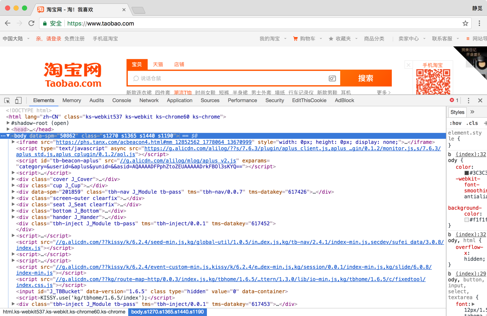

## 3. HTTP 和 HTTPS


也就是在 **TCP/IP** 四层模型中添加了一层 **SSL 层（或者叫 TLS）** ，并且，根据加密程度不同，所需要的费用不同。

**04 资源消耗：**如果大家访问 HTTPS 网站呢，对我们的CPU来说需要更高程度的计算。上面我们讲到了，对于 HTTPS 来说，连接安全的同时它需要 **加密传输和身份验证** ，其实这是基于 CPU 的运算，需要我们电脑的 CPU 不断进行加密解密的运算，这样就会对我们电脑的 CPU 和占用一些资源。大家访问 HTTP、HTTPS，访问不同的网站，对我们电脑的CPU的消耗是不一样的，HTTPS 需要很多很多的计算，才能进行加密验证。这些都是在我们电脑本地完成的。

### 3.1 HTTP

> HTTP 是一个客户端（用户）和服务器端（网站）之间请求和应答的标准，通常使用 [TCP协议](https://baike.baidu.com/item/TCP/33012?fromtitle=TCP%E5%8D%8F%E8%AE%AE&fromid=8988699&fr=aladdin)。通过使用[网页浏览器](https://baike.baidu.com/item/%E7%BD%91%E9%A1%B5%E6%B5%8F%E8%A7%88%E5%99%A8/8309940?fr=aladdin)、[网络爬虫](https://baike.baidu.com/item/%E7%BD%91%E7%BB%9C%E7%88%AC%E8%99%AB)或者其他的工具，客户端发起一个 HTTP 请求到服务器上指定端口（默认[端口](https://baike.baidu.com/item/%E7%AB%AF%E5%8F%A3)为80）。我们称这个客户端为用户代理程序（user agent）。应答的服务器上存储着一些资源，比如 **HTML** 文件和图像。我们称这个应答服务器为源服务器（origin server）。在用户代理和源服务器中间可能存在多个”中见层“，比如：[代理服务器](https://baike.baidu.com/item/%E4%BB%A3%E7%90%86%E6%9C%8D%E5%8A%A1%E5%99%A8/97996?fr=aladdin)、[网关](https://baike.baidu.com/item/%E7%BD%91%E5%85%B3)或者[隧道](https://baike.baidu.com/item/%E7%BD%91%E7%BB%9C%E9%9A%A7%E9%81%93/3993106?fr=aladdin)（tunnel）


我们平时写爬虫的时候就直接一个 **requestes** 过去，我们的电脑扮演的是 **客户端的角色**，我们 **requests 请求的网址**我们称之为：**服务器**。

大家即使是一个简单的 **get** 在网络就要经历许多层。这个模式我们叫做 **C/S 模式**服务器客户端模式。

上面我们说在请求网络的过程中会经过许多层，那这个 **层** 指的是什么呢？**有那几层呢？我们继续往下看！**

上面我们说在请求网络的过程中会经过许多层，那这个 **层** 指的是什么呢？**有那几层呢？我们继续往下看！**

| 名称         | 对应的意思                                                   |
| ------------ | ------------------------------------------------------------ |
| 应用层       | 应用程序是指人们用于网络通信的软件程序。有些终端用户应用程序是网络感知程序， |
|              | 即这些程序实现应用层协议，并可直接与协议栈的较低层通信。     |
|              | 电子邮件客户程序和 Web 浏览器就属于这种类型的应用程序。      |
| 网络层（IP） | cmd >>> ipconfig                                             |
|              | 到网络层，就会进行 **IP** 的封装，（也就是把你电脑的本地 IP 封装，放在你的数据上，前面 |
|              | 就加个头说：我是来自192.168.0.1 的电脑，发往百度的 IP 一个是百度的 IP 一个是你自己的 |
|              | IP ）之后就会携带着发起请求的目标服务器。（也就是是封装在你的 Get 请求上） |
| 隧道         | VPN                                                          |
| 网关         | 加码解码（类似于，把一个英文网站翻译成中文网站）             |
| 课下         | 自行看 TCP／UDP                                              |
| TCP          | 有连接的流形式，就类似我们打电话，也就类似我们的全双工，我可以和你说话，你也可以 |
|              | 和我说话。并且，我知道你能接起电话，你一定能听到我说话。     |
| UDP          | 面向无连接，不在乎你是否收到了我的信息。就类似于：发邮件的时候，你知道你的邮件发 |
|              | 出去了，但不确定对方能不能收到。                             |
| 对比         | 相对来说，UDP 回比 TCP 简单的多了。（我们的 HTPP 是使用 TCP的。） |


网络层就类似于我们的　**IP**

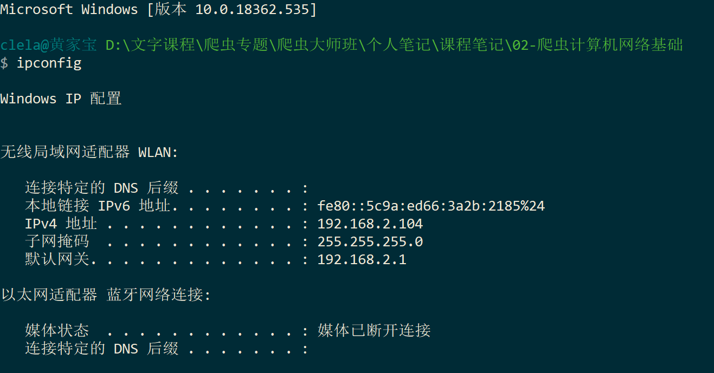

#### 3.1.1 HTTP 请求头详解

- **HTTP 头部**


---

举个例子：


上图中的 **Request Header** 有个

**Accept:text/html,application/xhtml+xml,application/xml;q=0.9,image/webp,image/apng,_/_;q=0.8,application/signed-exchange;v=b3**

这个如果加在你的请求头里面，就只会返回你要求的数据。

### 3.2 HTTPS

超文本传输安全协议（英语：HyperText Transfer Protocol Secure，缩写：HTTPS；常常称为：HTTP over TLS、


### 3.3 实例讲解

在淘宝的首页 [https://www.taobao.com/](https://www.taobao.com/)中，URL 的开头会有 http 或 https，这个就是访问资源需要的协议类型，有时我们还会看到 ftp、sftp、smb 开头的 URL，那么这里的 ftp、sftp、smb 都是指的协议类型。在爬虫中，我们抓取的页面通常就是 http 或 https 协议的，我们在这里首先来了解一下这两个协议的含义。

HTTP 的全称是 Hyper Text Transfer Protocol，中文名叫作超文本传输协议，HTTP 协议是用于从网络传输超文本数据到本地浏览器的传送协议，它能保证高效而准确地传送超文本文档。HTTP 由万维网协会（World Wide Web Consortium）和 Internet 工作小组 IETF（Internet Engineering Task Force）共同合作制定的规范，目前广泛使用的是 HTTP 1.1 版本。

HTTPS 的全称是 Hyper Text Transfer Protocol over Secure Socket Layer，是以安全为目标的 HTTP 通道，简单讲是 HTTP 的安全版，即 HTTP 下加入 SSL 层，简称为 HTTPS。

HTTPS 的安全基础是 SSL，因此通过它传输的内容都是经过 SSL 加密的，它的主要作用可以分为两种：

- 建立一个信息安全通道，来保证数据传输的安全。
- 确认网站的真实性，凡是使用了 HTTPS 的网站，都可以通过点击浏览器地址栏的锁头标志来查看网站认证之后的真实信息，也可以通过 CA 机构颁发的安全签章来查询。

现在越来越多的网站和 App 都已经向 HTTPS 方向发展。例如：

苹果公司强制所有 iOS App 在 2017 年 1 月 1 日 前全部改为使用 HTTPS 加密，否则 App 就无法在应用商店上架。
谷歌从 2017 年 1 月推出的 Chrome 56 开始，对未进行 HTTPS 加密的网址链接亮出风险提示，即在地址栏的显著位置提醒用户 “此网页不安全”。
腾讯微信小程序的官方需求文档要求后台使用 HTTPS 请求进行网络通信，不满足条件的域名和协议无法请求。
因此，HTTPS 已经已经是大势所趋。

## 4. HTTP 请求过程

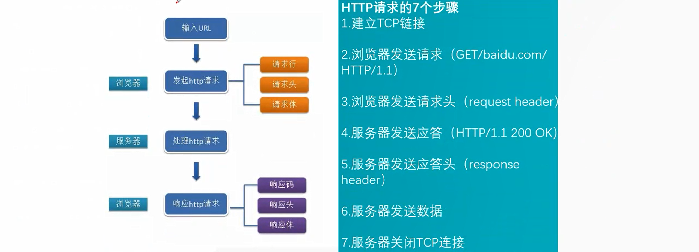

我们在浏览器中输入一个 URL，回车之后便可以在浏览器中观察到页面内容。实际上，这个过程是浏览器向网站所在的服务器发送了一个请求，网站服务器接收到这个请求后进行处理和解析，然后返回对应的响应，接着传回给浏览器。响应里包含了页面的源代码等内容，浏览器再对其进行解析，便将网页呈现了出来，传输模型如图所示。

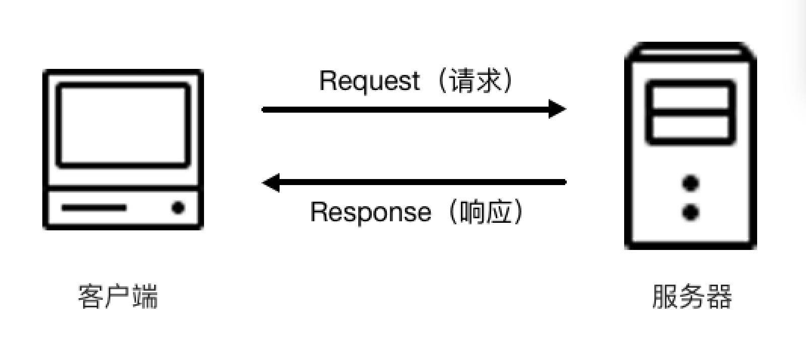

此处客户端即代表我们自己的 PC 或手机浏览器，服务器即要访问的网站所在的服务器。

为了更直观地说明这个过程，这里用 Chrome 浏览器的开发者模式下的 Network 监听组件来做下演示，它可以显示访问当前请求网页时发生的所有网络请求和响应。

打开 Chrome 浏览器，右击并选择 “检查” 项，即可打开浏览器的开发者工具。这里访问百度 [http://www.baidu.com/](http://www.baidu.com/)，输入该 URL 后回车，观察这个过程中发生了怎样的网络请求。可以看到，在 Network 页面下方出现了一个个的条目，其中一个条目就代表一次发送请求和接收响应的过程，如图所示。

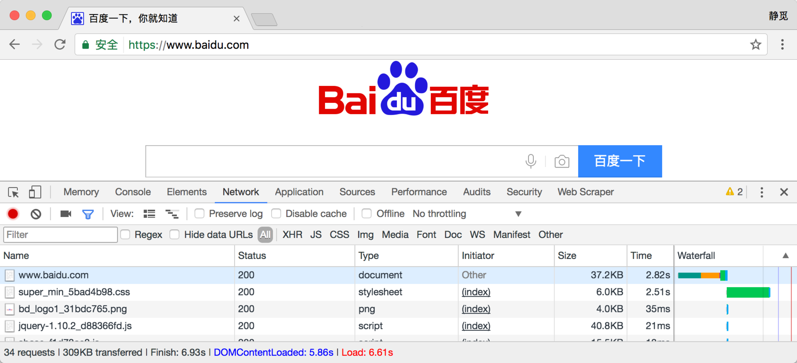

我们先观察第一个网络请求，即 www.baidu.com，其中各列的含义如下。

- 第一列 Name：请求的名称，一般会将 URL 的最后一部分内容当作名称。
- 第二列 Status：响应的状态码，这里显示为 200，代表响应是正常的。通过状态码，我们可以判断发送了请求之后是否得到了正常的响应。
- 第三列 Type：请求的文档类型。这里为 document，代表我们这次请求的是一个 HTML 文档，内容就是一些 HTML 代码。
- 第四列 Initiator：请求源。用来标记请求是由哪个对象或进程发起的。
- 第五列 Size：从服务器下载的文件和请求的资源大小。如果是从缓存中取得的资源，则该列会显示 from cache。
- 第六列 Time：发起请求到获取响应所用的总时间。
- 第七列 Waterfall：网络请求的可视化瀑布流。

我们点击这个条目即可看到其更详细的信息，如图所示。

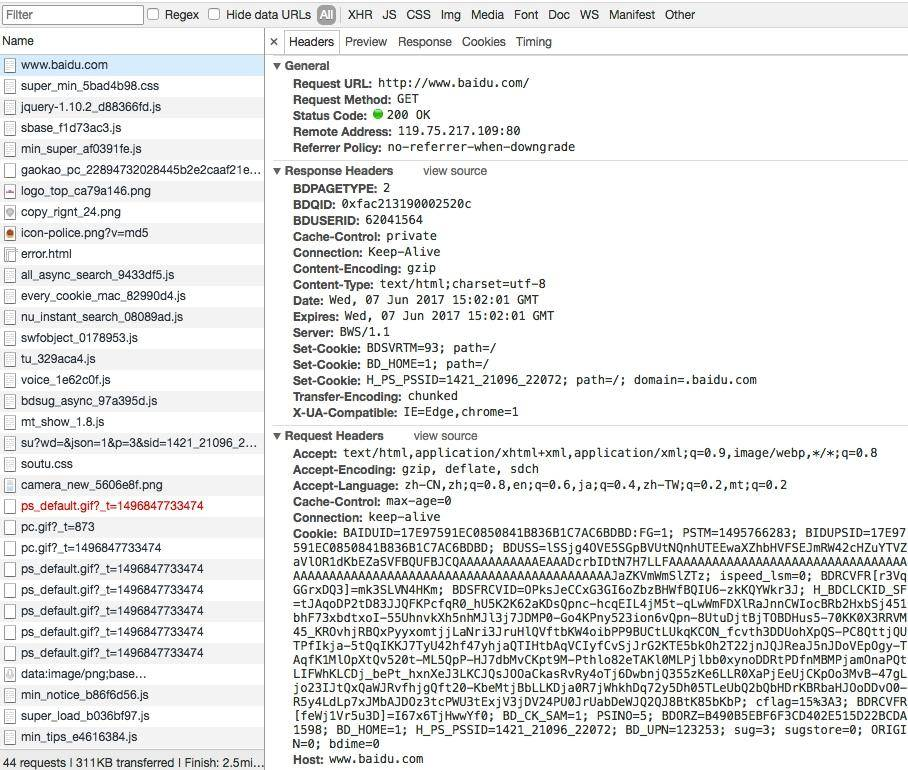

首先是 General 部分，Request URL 为请求的 URL，Request Method 为请求的方法，Status Code 为响应状态码，Remote Address 为远程服务器的地址和端口，Referrer Policy 为 Referrer 判别策略。

再继续往下，可以看到，有 Response Headers 和 Request Headers，这分别代表响应头和请求头。请求头里带有许多请求信息，例如浏览器标识、Cookies、Host 等信息，这是请求的一部分，服务器会根据请求头内的信息判断请求是否合法，进而作出对应的响应。图中看到的 Response Headers 就是响应的一部分，例如其中包含了服务器的类型、文档类型、日期等信息，浏览器接受到响应后，会解析响应内容，进而呈现网页内容。

下面我们分别来介绍一下请求和响应都包含哪些内容。

### 4.1 请求

请求，由客户端向服务端发出，可以分为 4 部分内容：请求方法（Request Method）、请求的网址（Request URL）、请求头（Request Headers）、请求体（Request Body）。

### 4.2 请求方法

常见的请求方法有两种：GET 和 POST。

在浏览器中直接输入 URL 并回车，这便发起了一个 GET 请求，请求的参数会直接包含到 URL 里。例如，在百度中搜索 Python，这就是一个 GET 请求，链接为 [https://www.baidu.com/s?wd=Python](https://www.baidu.com/s?wd=Python)，其中 URL 中包含了请求的参数信息，这里参数 wd 表示要搜寻的关键字。POST 请求大多在表单提交时发起。比如，对于一个登录表单，输入用户名和密码后，点击 “登录” 按钮，这通常会发起一个 POST 请求，其数据通常以表单的形式传输，而不会体现在 URL 中。

GET 和 POST 请求方法有如下区别。

- GET 请求中的参数包含在 URL 里面，数据可以在 URL 中看到，而 POST 请求的 URL 不会包含这些数据，数据都是通过表单形式传输的，会包含在请求体中。
- GET 请求提交的数据最多只有 1024 字节，而 POST 请求没有限制。

一般来说，登录时，需要提交用户名和密码，其中包含了敏感信息，使用 GET 方式请求的话，密码就会暴露在 URL 里面，造成密码泄露，所以这里最好以 POST 方式发送。上传文件时，由于文件内容比较大，也会选用 POST 方式。

#### 4.2.1 HTTP /1.1 方法

我们平常遇到的绝大部分请求都是 GET 或 POST 请求，另外还有一些请求方法，如 HEAD、PUT、DELETE、OPTIONS、CONNECT、TRACE 等，我们简单将其总结为下表。

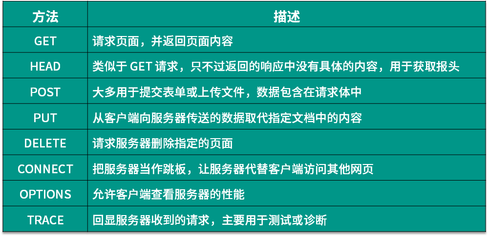

请求的网址本表参考：[http://www.runoob.com/http/http-methods.html](http://www.runoob.com/http/http-methods.html)。

请求的网址，即统一资源定位符 URL，它可以唯一确定我们想请求的资源。

| 请求类型 | 代表含义                                                     |
| -------- | ------------------------------------------------------------ |
| GET      | 向指定的资源发出 **“显示”** 请求，使用 **GET** 方法应该**只用在读取数据。**(请求源代码) |
| HEAD     | 与 **GET** 方法一样，都是向服务器发出**指定资源的请求。**只不过服务器将不传回资源的文本 |
|          | 部分。（在后端和前端交互的时候会使用的比较多，restful——前端与后端相处的接口。 |
|          | 平时我们所说的前后端分离，就是 **restful**)也就是会只返回 **Response Headers** 以很少网络流量获得概要信息 |
| POST     | 向指定资源提交数据，请求服务器进行处理（例如提交表单或者上传文件）。 |
| PUT      | 向指定资源位置上传最新内容。                                 |
| DELETE   | 请求服务器删除 Requests-URL 所标识的资源。                   |
| TRACE    | 回显服务器收到的请求，主要用于测试或诊断。                   |
| OPTIONS  | 这个方法可使服务器传**回该资源的所支持的所有 HTTP 请求方法。** |
| CONNECT  | HTTP/1.1 协议中预留给能够连接改为管道方式的代理服务器。      |
| PATCH    | 用于将局部修改应用到资源。                                   |


---

这个时候，有些小伙伴对 **head() 与 get() 有点区分不太出来，接下来给你们举个例子，更好的理解一下。**而上面我们对其他的请求方法的解析太过官方，接下来我也换一种方式来给同学们解析一下：

我们先来讲一讲 **Head 与 Get 的区别**

**Head() 与 Get() 的对比**

```python
# !/usr/bin/python3
# -*- coding: utf-8 -*-
# @Author：AI悦创 @DateTime ：2020/1/13 14:38 @Function ：功能  Development_tool ：PyCharm
# code is far away from bugs with the god animal protecting
#    I love animals. They taste delicious.
import requests
from bs4 import BeautifulSoup
url = 'https://www.baidu.com'
html_get = requests.get(url)
html_get.encoding = 'utf8'
get_soup = BeautifulSoup(html_get.text, 'lxml')
html_head = requests.head(url)
html_head.encoding = 'utf8'
head_soup = BeautifulSoup(html_head.text, 'lxml')
print(f'html.text_get:>>>{html_get.text}')
print(f'html.text_head:>>>{html_head.text}')
print(f'html.headers_get:>>>{html_get.headers}')
print(f'html.headers_head:>>>{html_head.headers}')
print(f'html.title_get:>>>{get_soup.title}')
print(f'html.title_head:>>>{head_soup.title}')

# ---------------输出--------------------
"C:\Program Files\Python37\python.exe" C:/Code/pycharm_daima/爬虫大师班/02-爬虫计算机网络基础/http_head_1.py
html.text_get:>>><!DOCTYPE html>
<!--STATUS OK--><html> <head><meta content=always name=referrer>.........略略略略略略略略略...........</html>

html.text_head:>>>
html.headers_get:>>>{'Cache-Control': 'private, no-cache, no-store, proxy-revalidate, no-transform', 'Connection': 'keep-alive', 'Content-Encoding': 'gzip', 'Content-Type': 'text/html', 'Date': 'Fri, 17 Jan 2020 11:04:53 GMT', 'Last-Modified': 'Mon, 23 Jan 2017 13:24:18 GMT', 'Pragma': 'no-cache', 'Server': 'bfe/1.0.8.18', 'Set-Cookie': 'BDORZ=27315; max-age=86400; domain=.baidu.com; path=/', 'Transfer-Encoding': 'chunked'}
html.headers_head:>>>{'Cache-Control': 'private, no-cache, no-store, proxy-revalidate, no-transform', 'Connection': 'keep-alive', 'Content-Encoding': 'gzip', 'Content-Type': 'text/html', 'Date': 'Fri, 17 Jan 2020 11:04:53 GMT', 'Last-Modified': 'Mon, 13 Jun 2016 02:50:26 GMT', 'Pragma': 'no-cache', 'Server': 'bfe/1.0.8.18'}
html.title_get:>>><title>百度一下，你就知道</title>
html.title_head:>>>None

Process finished with exit code 0
```

在上面程序的运行结果中，我给你们稍微的分析一下：Head() 与 Get() 在请求 [百度](https://www.baidu.com) 时，只是获取到了响应头（Response headers）的信息。

**总结：head() 就只是返回 Response Headers。**

我们下面来对比原网页的 **Response Headers**。我们会发现，内容上可以配对上，是 Response Headers 的内容。

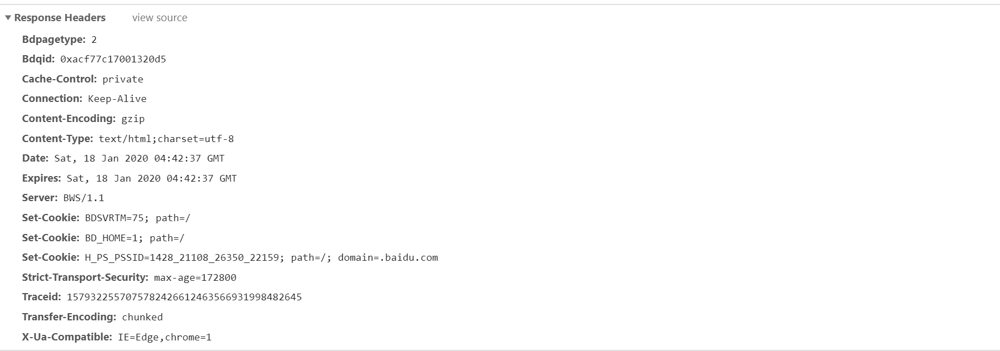

> Ps：截图与爬虫运行时间不同，所以图片的时间按你时间操作来对比哦。


**1. Head**

**Head** 有什么用，多用于服务器开发中用于测试的，我们 **Head** 只返回响应的头（**Response Headers**）。其实，也就是因为他（Head）返回的数据比较少，如果我们使用 **Get** 的方法返回的数据会比较大，这样回给网络占用很大的资源。（举个例子就是，假如你要发起一万个 **Get** 请求的话，那可想而知这个数据量是非常巨大的。而如果发起一个 **Head** 请求的话，一万个请求也不会太多。我们的服务器和我们的 **Cpu** 都是可以承受的。）即 **Head** 一般是用来测试的。

**2. PUT and POST**

**PUT** 与 **POST** 乍眼一看，好像 **PUT** 与 **POST** 一样，不过 **POST** 是可以提交任何数据的。而我们的 **PUT** 是用来提交更新的，比如你有一个博客，然后你发了一篇帖子。觉得内容少了一些东西，就修改了一下，最后重新提交上去，其实内部提交的是 **PUT** 。（注意，并不是所有程序员都遵守 **restful** ，有些程序员图省事，将所有请求都用 **Get** 所有发送表单都用 **Post** ，并不是不可以，只不过尽量遵守编写规范）

**3. Delete**

**Delete** 就是请求服务器删除一些资源，还是上面的例子，你发的博客，突然想删除，然后你点了一下删除键。实际上后端就会执行这个命令 **DELETE**

**4. TRACE**

**TRACE** 相当于我们日常的 **ping** 看我们能不能和 **服务器联通** 。有时候，我们在访问网站的时候，浏览器一直在转圈。这时候你可以自己 **ping** 试一下。 如果自己的 **ping** 不通的话，就不是人家网站的问题，而是你自身的内部路由器或者其他的问题了。（也就是与人家网站无关的）

也就是下面的这条 **CMD** （命令行）命令：

```cmd
# 这个是运维做的一个命令
nslookup
# 上面的命令的作用是：
# 启动我们电脑内置的 DNS 服务器
# DNS 就是给我们返回这些地址或域名等这些数据
```


比如我们访问，百度的这个网站：

里面的 **IP** 都是百度的 **IP** 地址，当然，我们访问 www.a.shifen.com 也是会跳转到百度的页面。


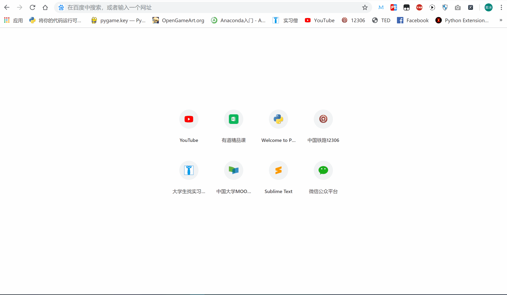


---

一般，你在浏览器发起的  **GET** 请求，就是在我们的计算机内部执行了一下： **nslookup** 下面的 **www.baidu.com** （看你实际访问的网址），通过 **DNS** 返回地址来（也就是 **IP** 地址），之后再访问这个 **IP** 地址。

而且，我们服务器用的都是 **IP** 地址，是不用这个 **域名服务的** 。所以使用 **DNS** 来解析一下对应的 **IP** 地址并进行 **访问** 。

上面我们演示了使用 **DNS** 解析之后的域名本质上是 **IP 地址 加上 80 端口**

**非权威应答:** 就是说，我们不保证这个是安全的，中间有可能受到黑客的攻击。我们看到的这个东西，有可能受到黑客篡改。

**5. Options:** 返回可以请求的 **方法比如：Get、Head、Post、Delete、Put等** 但是在你访问一些老的网站，甚至会报错，因为当初哪有 **Restful** 这一方法，现在再加上这些也没太多作用。所以也就是：**Options 就是返回显示，支持你使用什么方法去访问该网站** 。

```python
import requests
html_keyoudao_options = requests.options('https://ke.youdao.com/')
print(html_keyoudao_options.text)

# 输出
"C:\Program Files\Python37\python.exe" C:/Code/pycharm_daima/爬虫大师班/02-爬虫计算机网络基础/https_options.py
GET,HEAD

Process finished with exit code 0
```

**6. Connect ：** 为以后预留的，现在还没用到。

**7. Patch：** 与 **Put、Post** 差不多，不过它比 **Put** 更轻量级一些， **Patch** 就是只改局部，比 **Put** 更小了。就类似你就改一篇文章或者一张图片中的一小部分。很小的局部修改，就用 **Patch**

---

### 4.3 请求头

请求头，用来说明服务器要使用的附加信息，比较重要的信息有 Cookie、Referer、User-Agent 等。下面简要说明一些常用的头信息。

- Accept：请求报头域，用于指定客户端可接受哪些类型的信息。
- Accept-Language：指定客户端可接受的语言类型。
- Accept-Encoding：指定客户端可接受的内容编码。
- Host：用于指定请求资源的主机 IP 和端口号，其内容为请求 URL 的原始服务器或网关的位置。从 HTTP 1.1 版本开始，请求必须包含此内容。
- Cookie：也常用复数形式 Cookies，这是网站为了辨别用户进行会话跟踪而存储在用户本地的数据。它的主要功能是维持当前访问会话。例如，我们输入用户名和密码成功登录某个网站后，服务器会用会话保存登录状态信息，后面我们每次刷新或请求该站点的其他页面时，会发现都是登录状态，这就是 Cookies 的功劳。Cookies 里有信息标识了我们所对应的服务器的会话，每次浏览器在请求该站点的页面时，都会在请求头中加上 Cookies 并将其发送给服务器，服务器通过 Cookies 识别出是我们自己，并且查出当前状态是登录状态，所以返回结果就是登录之后才能看到的网页内容。
- Referer：此内容用来标识这个请求是从哪个页面发过来的，服务器可以拿到这一信息并做相应的处理，如做来源统计、防盗链处理等。
- User-Agent：简称 UA，它是一个特殊的字符串头，可以使服务器识别客户使用的操作系统及版本、浏览器及版本等信息。在做爬虫时加上此信息，可以伪装为浏览器；如果不加，很可能会被识别出为爬虫。
- Content-Type：也叫互联网媒体类型（Internet Media Type）或者 MIME 类型，在 HTTP 协议消息头中，它用来表示具体请求中的媒体类型信息。例如，text/html 代表 HTML 格式，image/gif 代表 GIF 图片，application/json 代表 JSON 类型，更多对应关系可以查看此对照表：[http://tool.oschina.net/commons](http://tool.oschina.net/commons)。

因此，请求头是请求的重要组成部分，在写爬虫时，大部分情况下都需要设定请求头。

### 4.4 请求体

请求体一般承载的内容是 POST 请求中的表单数据，而对于 GET 请求，请求体则为空。

例如，这里我登录 GitHub 时捕获到的请求和响应如图所示。

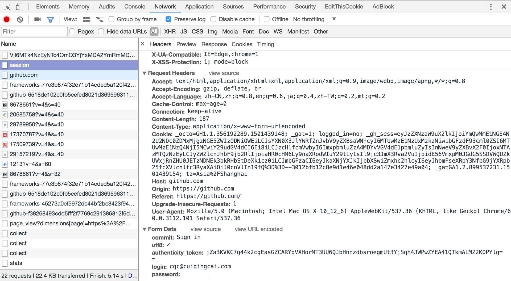

登录之前，我们填写了用户名和密码信息，提交时这些内容就会以表单数据的形式提交给服务器，此时需要注意 Request Headers 中指定 Content-Type 为 application/x-www-form-urlencoded。只有设置 Content-Type 为 application/x-www-form-urlencoded，才会以表单数据的形式提交。另外，我们也可以将 Content-Type 设置为 application/json 来提交 JSON 数据，或者设置为 multipart/form-data 来上传文件。

表格中列出了 Content-Type 和 POST 提交数据方式的关系。

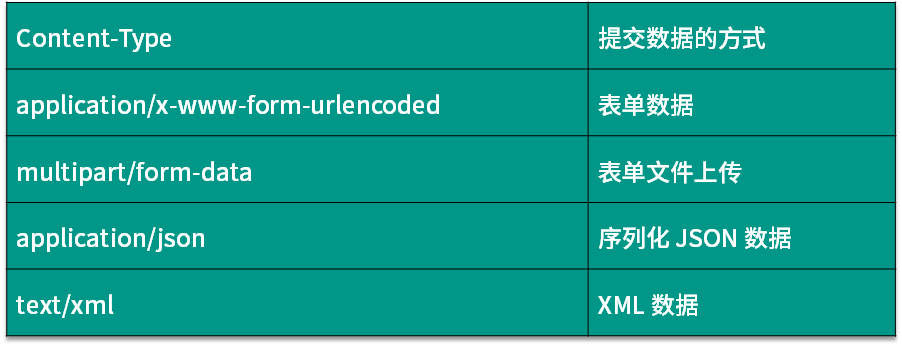

在爬虫中，如果要构造 POST 请求，需要使用正确的 Content-Type，并了解各种请求库的各个参数设置时使用的是哪种 Content-Type，不然可能会导致 POST 提交后无法正常响应。

### 4.5 响应

响应，由服务端返回给客户端，可以分为三部分：响应状态码（Response Status Code）、响应头（Response Headers）和响应体（Response Body）。

### 4.6 响应状态码


响应状态码表示服务器的响应状态，如 200 代表服务器正常响应，404 代表页面未找到，500 代表服务器内部发生错误。在爬虫中，我们可以根据状态码来判断服务器响应状态，如状态码为 200，则证明成功返回数据，再进行进一步的处理，否则直接忽略。下表列出了常见的错误代码及错误原因。

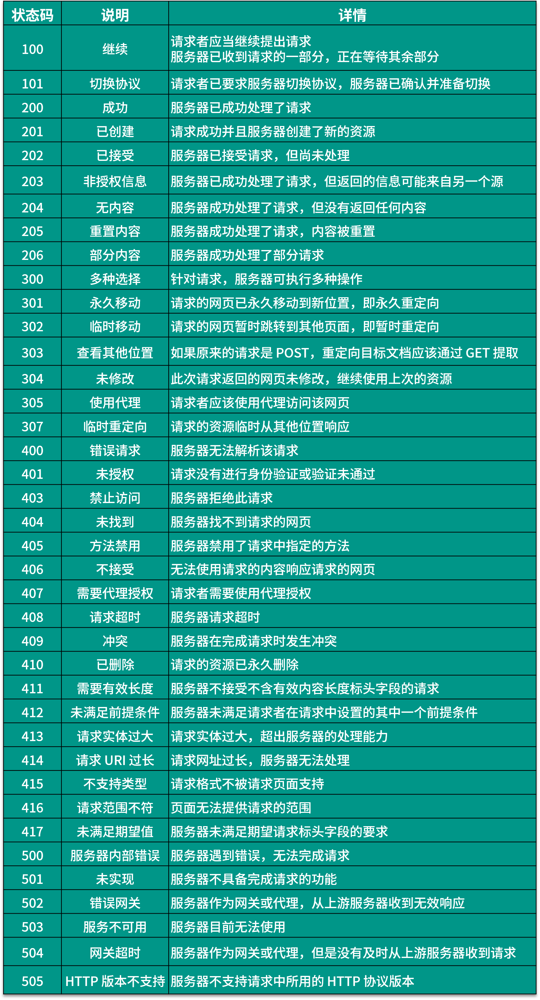

响应头包含了服务器对请求的应答信息，如 Content-Type、Server、Set-Cookie 等。下面简要说明一些常用的响应头信息。

- Date：标识响应产生的时间。
- Last-Modified：指定资源的最后修改时间。
- Content-Encoding：指定响应内容的编码。
- Server：包含服务器的信息，比如名称、版本号等。
- Content-Type：文档类型，指定返回的数据类型是什么，如 text/html 代表返回 HTML 文档，application/x-javascript 则代表返回
- JavaScript 文件，image/jpeg 则代表返回图片。
- Set-Cookie：设置 Cookies。响应头中的 Set-Cookie 告诉浏览器需要将此内容放在 Cookies 中，下次请求携带 Cookies 请求。
- Expires：指定响应的过期时间，可以使代理服务器或浏览器将加载的内容更新到缓存中。如果再次访问时，就可以直接从缓存中加载，降低服务器负载，缩短加载时间。

**文字补充**

| 响应码  | 对应含义                                                     |
| :-----: | ------------------------------------------------------------ |
|   5xx   | 就是响应，这个服务器挂了。这个就和你电脑没有任何关系。       |
|         | （你的浏览器、你的客户端没有问题，只不过，我本身不能为你提供服务了。) |
|   2xx   | 以2开头的基本上是没问题的，是可以正常返回数据的。            |
| **201** | **请求开始创建了**                                           |
|   202   | 请求创建之后，服务器接受了                                   |
|   204   | 就是返回的这个，没有内容（信息）                             |
| **206** | **放回部分信息**（一般是返回图片）                           |
|         | 举个例子就是，有时候我们访问网站的时候，有些图标是模糊不清的， |
|         | 这时候后台就会默默的发起一个206 的请求。这样图片就过几秒就清晰了。 |
|   3xx   | 一般是重定向（有时候，你访问的是另一个网站，                 |
|         | 这时候有时候网站会给你重定向跳转到另一个网页，也就是我们的 30几 |
| **301** | **永久移动**                                                 |
| **302** | **暂时移动**                                                 |
|   4xx   | 出错啦                                                       |
|   401   | 未验证，也就是：那个页面需要你登陆一些个人信息，如果直接访问，它就会出现 401 页面 |
|   403   | 说明你的 **IP** 被封了，它禁止你登陆咯                       |
|   404   | 你有可能路由写错了                                           |
|   405   | 就是这个页面原本只能用 **get** 方法来请求，而你却用 **Post** 的方法来请求， |
|         | 提醒你，你是不是写错了                                       |
|   408   | 请求超时（有可能是你服务器的问题，当然也有可能是你的问题。一般来说：个人问题居多） |
|   5xx   | 就是网站崩了，网关不支持、没有挂载啥的                       |


那，这个状态码该怎么看呢？

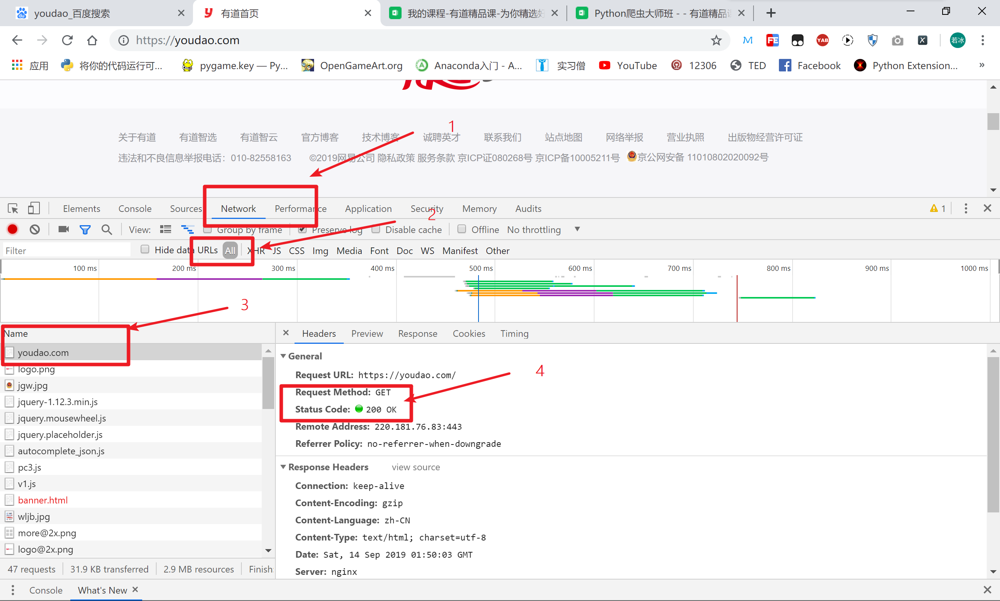

当然也可以用代码来查看咯！

```python
import requests

url = 'https://www.baidu.com'
html = requests.get(url)
print(html.status_code)

# 输出
200
```

**重定向**

1. 打开：cmd
2. 输入：nslookup
3. 输入：www.baidu.com
4. 得到以下结果：

```python
> www.baidu.com
服务器:  192.168.1.1
Address:  192.168.1.1

非权威应答:
名称:    www.a.shifen.com
Addresses:  14.215.177.39
          14.215.177.38
Aliases:  www.baidu.com
```

那从上面得到的结果，如果我访问：www.a.shifen.com 它就会给你跳转到另外的网站，这就是我们所说的重定向。——也就是如下图所示，跳转到了百度页面。

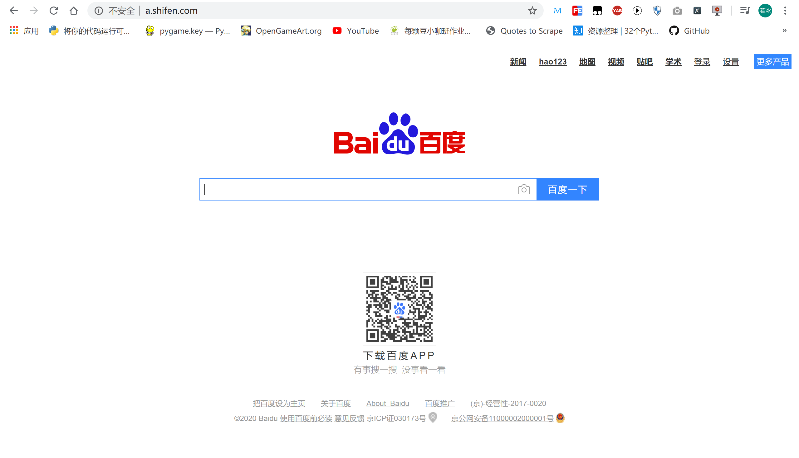

我们使用代码也可以直观的看见访问的状态码：

```python
import requests

url = 'http://www.a.shifen.com/'
html = requests.get(url)
print(html.status_code)
# 输出
302
```

### 4.7 响应体

最重要的当属响应体的内容了。响应的正文数据都在响应体中，比如请求网页时，它的响应体就是网页的 HTML 代码；请求一张图片时，它的响应体就是图片的二进制数据。我们做爬虫请求网页后，要解析的内容就是响应体，如图所示。


在浏览器开发者工具中点击 Preview，就可以看到网页的源代码，也就是响应体的内容，它是解析的目标。

在做爬虫时，我们主要通过响应体得到网页的源代码、JSON 数据等，然后从中做相应内容的提取。

### 4.8 请求字段展示

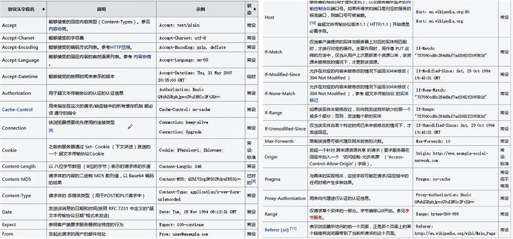

---

DNT：就是是否允许网站对你的操作进行追踪，DNT = 1 也就是 True，允许。反之亦然。

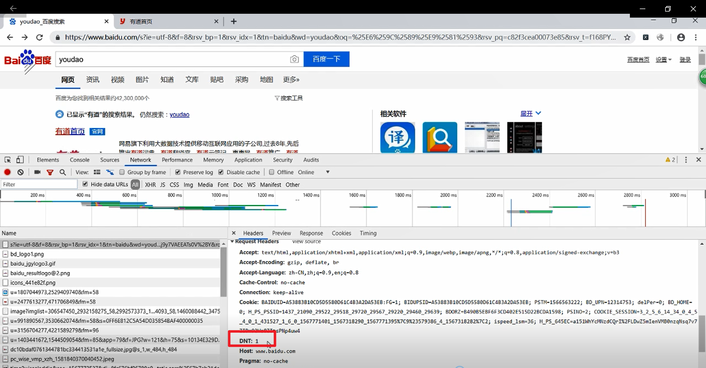

**Disable cache：** 就是禁用缓存，每次请求都需要重新建立 **TCP/IP** 四层模型，不使用的话，就会调用缓存。


上面的代码不完整，就看红色框即可，就是设置请求头我接受什么数据。


短连接，就需要每次发起请求重新握手，长连接则不需要。

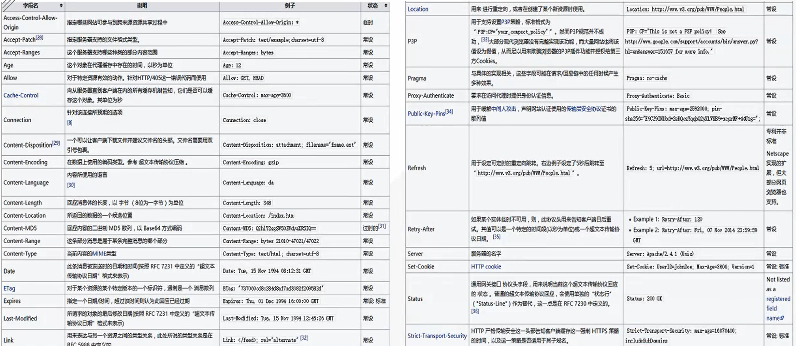

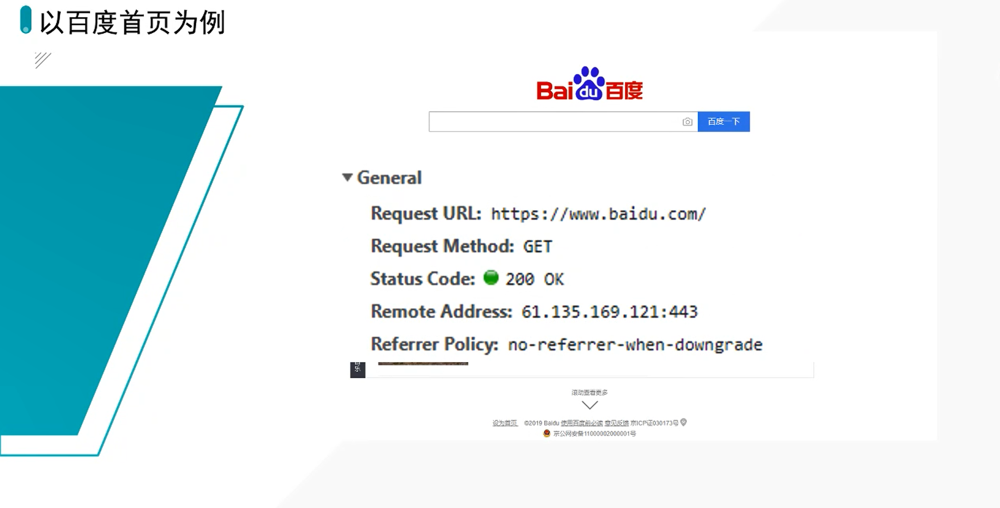

---

好了，今天的内容就全部讲完了，本课时中，我们了解了 HTTP 的基本原理，大概了解了访问网页时背后的请求和响应过程。本课时涉及的知识点需要好好掌握，后面分析网页请求时会经常用到。

欢迎关注我公众号：AI悦创，有更多更好玩的等你发现！

::: details 公众号：AI悦创【二维码】


:::

::: info AI悦创·编程一对一

AI悦创·推出辅导班啦，包括「Python 语言辅导班、C++ 辅导班、java 辅导班、算法/数据结构辅导班、少儿编程、pygame 游戏开发、Web全栈、Linux」，全部都是一对一教学：一对一辅导 + 一对一答疑 + 布置作业 + 项目实践等。当然，还有线下线上摄影课程、Photoshop、Premiere 一对一教学、QQ、微信在线，随时响应！微信：Jiabcdefh

C++ 信息奥赛题解，长期更新！长期招收一对一中小学信息奥赛集训，莆田、厦门地区有机会线下上门，其他地区线上。微信：Jiabcdefh

方法一：[QQ](http://wpa.qq.com/msgrd?v=3&uin=1432803776&site=qq&menu=yes)

方法二：微信：Jiabcdefh

:::

